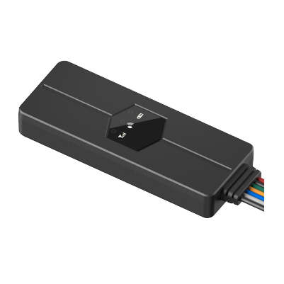

# Concox - EG02

The Concox EG02 GPS tracker is a compact and effective anti-theft solution for electric scooters. With its plug & play design, it is incredibly easy to install and use. The EG02 supports GPS and LBS real-time tracking, allowing you to keep an eye on your e-bike's location at all times. Through the accompanying mobile app, you can remotely lock and unlock your scooter, providing an added layer of security. In the event of unauthorized movement, the EG02 will trigger an audio alarm, alerting you and deterring potential thieves.

One of the standout features of the EG02 is its wide working voltage range of 9-90V, making it compatible with a variety of e-bike models on the market. This versatility extends to other vehicles as well, including industrial equipment, scooters, and golf carts. The device also offers optimized battery protection, preventing drain or damage to your vehicle's battery.

With the EG02, you can enjoy keyless start functionality, starting your e-scooter through the mobile app or SMS. The device also provides multiple alerts for atypical events such as abnormal vibration, speeding, power-off, and geo-fence entry/exit. Additionally, the EG02 supports external buzzer integration for enhanced theft deterrence and e-scooter searching.

Overall, the Concox EG02 GPS tracker is a reliable and user-friendly solution for protecting your electric scooter. Its compact size, plug & play installation, and advanced features make it an excellent choice for anyone looking to enhance the security of their e-bike.

