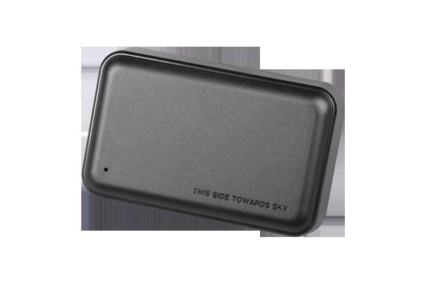

# Concox - GT03A

The Concox GT03A is a compact GPS vehicle tracker designed to provide accurate and reliable location monitoring for cars and light commercial vehicles. It combines GPS positioning with LBS location assistance and quad band GSM connectivity to maintain communication across different regions. The device includes practical features such as an SOS emergency alarm, geo-fencing, voice monitoring, moving detection for alarms, status LEDs, and a large capacity polymer battery for extended standby periods. Its built in magnets allow fast attachment to metal surfaces for flexible deployment.

As a Plaspy compatible device, the GT03A can feed location and status information into Plaspy for centralized fleet and asset oversight. Compatibility enables organizations to use Plaspy’s dashboards, alerting, and reporting around the GT03A’s capabilities to improve operational visibility. This guide explains what the tracker offers, how it commonly integrates with Plaspy, and which use cases tend to benefit from this pairing.

## Key Highlights

- Dual locating using GPS plus LBS for improved coverage in varied environments.  
- Quad band GSM compatibility for broad regional connectivity.  
- SOS alarm that can notify designated contacts or monitoring systems in emergencies.  
- Built in magnets for quick and unobtrusive attachment to metal surfaces.  
- Long standby performance supported by a large capacity polymer battery.  
- Built in moving detection and geo-fencing support for basic perimeter and motion alerts.  
- Voice monitoring and multi color LED indicators for simple status feedback.

## How It Works with Plaspy

The GT03A transmits location and status events that Plaspy ingests for mapping, alerting, and reporting. Within Plaspy, these inputs become part of a vehicle’s telemetry history and operational record, enabling real time oversight and historical analysis.

- Real time location display on Plaspy maps for live vehicle visibility.  
- Geo-fence event handling and notifications when boundaries are crossed.  
- SOS alarm forwarding and escalation through Plaspy alert channels.  
- Historical route playback and event logs to support post incident review and reporting.  
- Fleet level summaries and status indicators to assist operational decision making.

## Typical Use Cases

- Monitoring company cars and light commercial vehicle fleets for location and movement.  
- Rapid deployment asset tracking where magnetic mounting is useful for temporary installs.  
- Security and recovery scenarios using SOS alarms and geo-fence alerts.  
- Rental or shared vehicle oversight where standby battery life and discreet mounting matter.  
- Operational visibility and basic voice monitoring for selected vehicle checks.

## Why Choose This Tracker with Plaspy

The Concox GT03A is a practical choice when you need a straightforward vehicle tracker that balances positioning, emergency alerting, and easy mounting. Paired with Plaspy, the device’s location and event data can be integrated into a single fleet management view, making it simpler to monitor vehicles, respond to incidents, and produce operational reports.

While the GT03A provides a solid set of features for many fleet and vehicle monitoring scenarios, organizations should evaluate their specific needs for reporting depth, integration workflows, and deployment scale. Plaspy can help centralize GT03A data alongside other devices to provide unified visibility across mixed fleets.

To learn more about how Plaspy can work with Concox devices and to explore platform features visit https://www.plaspy.com. Product specifications, availability, and manufacturer details can change over time, so please verify current technical specifications and compatibility information on the manufacturer site https://www.iconcox.com/.
