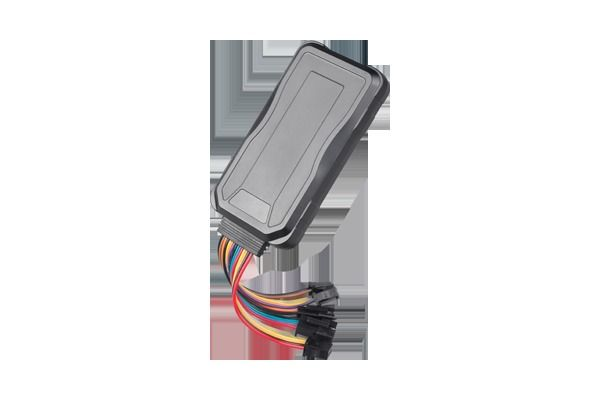

# Concox - GT06E

The Concox GT06E is a versatile 3G GPS tracker designed for vehicle tracking and fleet management. It provides real time location information and includes common tracking functions such as tele cutoff petrol, geofence, SOS alarm, and overspeed alert. The device also supports optional digital outputs for door detection, audio visual alerts for vehicle pinpointing, and external power voltage monitoring, making it suitable for a range of monitoring and security needs.

As a Plaspy compatible device, the GT06E can feed its location and event data into Plaspy for centralized visibility and operational oversight. Plaspy can surface the tracker’s position, alerts, and input status within fleet dashboards and reporting tools, enabling businesses to use the GT06E as part of a broader vehicle tracking and management workflow.

## Key Highlights

- 3G connectivity for timely transmission of position and event data
- Real time location reporting suited to fleet visibility and dispatch
- Geofence and overspeed alerts for route and behavior monitoring
- SOS alarm and alerting for emergency response and driver safety
- Optional digital outputs for door detection and audio visual vehicle pinpointing
- External power voltage monitoring to help track vehicle power status

## How It Works with Plaspy

When paired with Plaspy, the GT06E delivers location updates and device events into the Plaspy platform so fleets can monitor vehicles on a single map and review historical activity. Plaspy organizes incoming data into actionable alerts and reports to support daily operations and long term analysis.

- Live map view of GT06E positions for real time fleet monitoring
- Geofence and overspeed events routed to Plaspy alerts and notifications
- SOS and other alarm events surfaced to operators for rapid attention
- Optional door and external power status shown in vehicle detail views
- Historical playback and reporting for route review and compliance checks

## Typical Use Cases

- Commercial fleet dispatch and route monitoring for delivery and service vehicles
- Vehicle security and recovery workflows using location and SOS alerts
- Operational oversight where door status and external power monitoring add context
- Safety and compliance monitoring through geofence and overspeed alerts
- Single vehicle tracking up to mixed fleets requiring consolidated visibility

## Why Choose This Tracker with Plaspy

The GT06E combines a common set of fleet oriented features with optional inputs that provide extra operational context. For organizations using Plaspy, that combination means straightforward integration of location, alerting, and device status into the same platform where dispatch, reporting, and oversight occur. Plaspy users can take advantage of the GT06E’s event types to build meaningful alerts and reports without needing specialized device knowledge.

If your requirements emphasize reliable position updates, standard alarm types, and optional IO monitoring for vehicle status, the GT06E is a practical choice to consider for use with Plaspy. The model’s feature set supports core fleet management workflows while allowing the Plaspy platform to centralize visibility and reporting.

To learn more about using the GT06E with Plaspy visit https://www.plaspy.com. Product specifications, availability, and manufacturer details can change over time, so please verify current specifications and documentation with the manufacturer at https://www.iconcox.com/.
