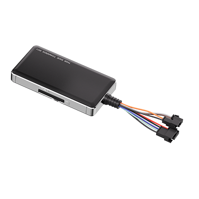

# Concox - GT06N 4G

The GT06N 4G is a compact vehicle GPS tracker from Concox designed for professional fleet management and secure asset monitoring. Built to cover a wide range of vehicles from passenger cars to heavy trucks and electric two wheelers, the device provides real time location, driver behavior telemetry, and anti theft controls that fleet operators expect for improved safety and efficiency.

As a Plaspy compatible device, the GT06N 4G can feed location and event data into Plaspy so operators can centralize monitoring and reporting. Its event driven alerts such as SOS, tamper notices, and accelerometer based incidents become actionable items in Plaspy dashboards and reports, helping teams respond faster and maintain clearer operational visibility across mixed fleets.

## Key Highlights

- Compatible with Plaspy for centralized fleet visibility and consolidated reporting.
- LTE Cat 1 4G connectivity for continuous telemetry uplink and real time updates.
- Multi constellation GNSS support including GPS, BDS, and GLONASS for reliable position fixes.
- Onboard accelerometer and event detection for harsh driving and tamper alerts.
- Ignition detection plus relay based immobilizer control to support anti theft workflows.
- In cabin SOS button and remote listen in for emergency awareness and response.
- Broad vehicle voltage range and compact industrial form factor suitable for diverse fleet types.

## How It Works with Plaspy

When paired with Plaspy, the GT06N 4G streams vehicle position and key events into the Plaspy platform so fleet managers can monitor assets in real time, receive alerts, and produce historical reports. Device events map to Plaspy notifications and workflows so teams can act on incidents quickly and maintain audit trails.

- Real time location and movement updates visible on Plaspy maps and live views.
- Alerts for SOS, tamper, and harsh driving appear in Plaspy notification streams for fast response.
- Ignition status and immobilizer controls surface in Plaspy to support remote intervention where configured.
- Event driven reporting and historical route playback for post incident analysis and compliance.
- Aggregated fleet metrics and per vehicle timelines to support operational oversight and driver coaching.

## Typical Use Cases

- Mixed fleet tracking across passenger cars, trucks, and two wheelers for logistics operations.
- Anti theft monitoring and recovery workflows using ignition detection and remote immobilizer control.
- Emergency response for passenger facing services using SOS alerts and remote listen in.
- Driver behavior monitoring and coaching programs driven by accelerometer based events.
- Asset tracking for finance and security use cases with tamper alerts and historical data retention.

## Why Choose This Tracker with Plaspy

The GT06N 4G pairs practical vehicle hardware with Plaspy’s fleet management tools to deliver dependable location visibility and event awareness. Its multi constellation GNSS, event driven alerts, and immobilizer capability make it well suited to operators who need straightforward telemetry and security functions across a diverse vehicle mix.

If you want to evaluate compatibility and see how the GT06N 4G works within a Plaspy deployment, learn more about Plaspy on the main website https://www.plaspy.com. Product specifications, availability, and manufacturer details can change over time, so verify current technical information on the official Concox site https://www.iconcox.com/.
