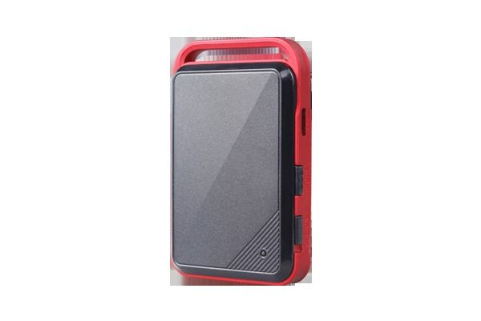

# Concox - GT350

The Concox GT350 is a compact personal GPS tracker designed for people who need continuous location monitoring. It targets users such as inspectors, travelers, and outworkers, delivering a balance of portability and durability. Key features highlighted by the manufacturer include long stand-by time for extended use, emergency tracking for quick response, geofencing with instant notifications, voice monitoring for situational awareness, and an SOS alarm for critical situations.

As a Plaspy compatible device, the GT350 can be integrated into a centralized monitoring workflow to provide visibility and alerts where personal safety and situational awareness matter. Plaspy can receive the GT350 location and event data to present live positions, forward geofence and SOS notifications, and keep historical records for review. This makes the GT350 a practical option when you want compact personal tracking combined with Plaspy's operational oversight and reporting capabilities.

## Key Highlights

- Compact form factor suitable for personal carry and mobile staff
- Long stand by time supports extended field use without frequent recharging
- Emergency tracking capability to help responders locate a user quickly
- Geo-fence functionality with notifications when boundaries are crossed
- Voice monitoring option for added situational awareness
- Built in SOS alarm to alert designated contacts in critical scenarios
- Durable construction intended for everyday use in mobile environments

## How It Works with Plaspy

When used with Plaspy, the GT350 becomes part of a unified monitoring and alerting environment that helps organizations track personnel and respond to incidents more effectively. Plaspy can aggregate location updates and events from GT350 units and surface them in dashboards, maps, and alert feeds.

- Live location display for monitored devices within the Plaspy platform
- Geofence alerts forwarded to Plaspy so teams can be notified of boundary crossings
- SOS event forwarding to escalate critical alerts to designated operators
- Event history and position logs available for review in Plaspy reporting
- Centralized visibility for dispersed personnel to support operational oversight

## Typical Use Cases

- Safety monitoring for inspectors and field auditors working alone
- Travel security for staff and contractors in transit or remote locations
- Lone worker protection where quick emergency response is required
- Temporary tracking for short term assignments or site visits
- Personal security for travelers and vulnerable individuals in the field

## Why Choose This Tracker with Plaspy

The GT350 is a sensible choice for organizations that need a straightforward personal tracker with safety focused features. Its compact and durable design, combined with long stand by time and dedicated emergency functions, matches common requirements for lone worker safety and mobile staff monitoring. Using the GT350 with Plaspy lets teams centralize alerts and location information so they can maintain situational awareness across personnel without managing multiple point solutions.

If you want broader operational visibility and consolidated reporting, pairing the GT350 with Plaspy provides a practical path to consistent monitoring and alerting. Learn more about how Plaspy can support personal and fleet tracking on the main website https://www.plaspy.com. Product specifications, availability, and manufacturer details can change over time, so please verify current technical information on the official Concox website https://www.iconcox.com/.
