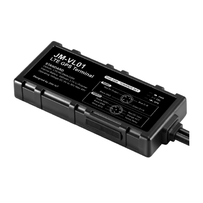

# Concox - JM-VL01

Improve the performance of your fleet business today with the feature-rich and lightning-fast JM-VL01 GPS tracker from Concox. This powerful and easy-to-install 4G tracker provides actionable telematics insights to help you effectively manage your fleet. With its wide range of features and capabilities, the JM-VL01 is a valuable asset for any fleet management strategy.

The JM-VL01 operates on LTE, UMTS, and GSM networks, ensuring reliable and fast data transmission and reception. It offers standard functions such as GPS location tracking and geo-fence alerts, allowing you to monitor the whereabouts of your vehicles and receive notifications when they enter or exit designated areas. Additionally, the JM-VL01 provides a suite of event-triggered alerts, including dangerous driving behavior detection, abnormal vibration detection, speeding alerts, and power supply disconnection alerts. These instant alerts enable you to take immediate action and ensure the safety and efficiency of your fleet.

One of the standout features of the JM-VL01 is its ignition detection capability. It constantly monitors the ACC/ignition status of the vehicle, providing you with real-time information about the vehicle's operational status. Moreover, the JM-VL01 offers a remote cut-off feature, allowing you to immobilize a vehicle by cutting off its power source or fuel supply via an installed relay. This feature can be extremely useful in case of theft or unauthorized use of the vehicle.

The JM-VL01 also offers optional add-ons such as RS485 fuel and temperature sensors. The RS485 fuel sensor provides quick notifications when the fuel level is harshly changing, helping you detect fuel theft or abnormal fuel consumption. The RS485 temperature sensor helps prevent damage caused by excessive temperature, ensuring the safety and integrity of your cargo.

With its panic button feature, the JM-VL01 allows drivers to contact dispatch or emergency support with a discreet in-cabin SOS button. This feature provides an added layer of security and peace of mind for drivers in case of emergencies or dangerous situations.

Overall, the JM-VL01 GPS tracker from Concox is a reliable and feature-packed solution for fleet management. Its advanced capabilities, including ignition detection, remote cut-off, and optional add-ons, make it an invaluable tool for optimizing the performance and safety of your fleet.

