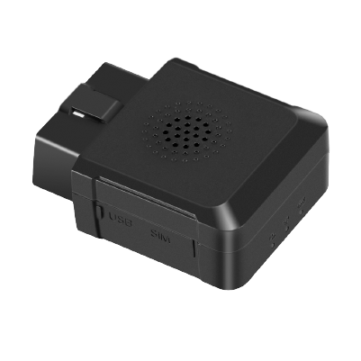

# Concox - JM-VL04

The JM-VL04 is a professional 4G OBD vehicle tracker from Concox designed for vehicle tracking and fleet management. It combines an OBD form factor with embedded motion sensors and algorithms to detect driving behaviors, calculate mileage, and maintain location awareness even in challenging GNSS conditions. The device supports multiple communication bands to work across 4G 3G and 2G coverage and includes features such as voice alarm and remote listen in via an embedded microphone.

As a Plaspy compatible device, the JM-VL04 can feed vehicle location, behavior alerts, and mileage data into Plaspy for centralized monitoring and reporting. Its broad network support and continuous tracking capabilities make it suitable for fleet operators who need reliable connectivity and actionable visibility in Plaspy, while BLE connectivity enables on site parameter configuration and maintenance tasks that integrate with standard device management workflows.

## Key Highlights

- 4G OBD form factor designed for vehicle integration and continuous power from vehicle supply
- Built in accelerometer and gyroscope with algorithms for detecting improper driving behavior
- Mileage calculation capability to support operational reporting and maintenance planning
- Measures to reduce GNSS dark spots for improved tracking in areas with poor satellite reception
- Support for a wide range of 4G communication modules with fallback to 3G and 2G coverage
- Voice alarm to provide in vehicle driver warnings and an embedded microphone for remote listen in
- BLE4.0 support for local parameter configuration and device maintenance

## How It Works with Plaspy

When connected to Plaspy, the JM-VL04 supplies location and vehicle status data that Plaspy consolidates into live maps, alerts, and historical reports. Plaspy uses incoming messages from the tracker to provide real time monitoring and to generate insights that help manage fleets more effectively.

- Surface live vehicle positions and recent tracks on Plaspy maps for dispatch and oversight
- Trigger alerts in Plaspy for detected unsafe driving behaviors and receive voice alarm events as part of incident workflows
- Compile mileage logs in Plaspy for maintenance scheduling and operational cost tracking
- Maintain visibility in areas with weak GNSS signal by using the device improvements to minimize tracking gaps in Plaspy
- Use Plaspy reporting tools to analyze driving patterns and fleet performance based on the JM-VL04 data

## Typical Use Cases

- Commercial fleet monitoring for delivery and service vehicles
- Driver safety programs that track and coach on improper driving behaviors
- Mileage tracking for maintenance planning billing and operational audits
- Vehicle security and situational awareness using remote listen in and alarm events
- Rental and leasing fleets that require centralized oversight and usage reporting

## Why Choose This Tracker with Plaspy

The JM-VL04 is a practical choice for organizations that want an OBD style tracker with built in motion sensing and behavior analysis. Its multi band communication support and features to mitigate GNSS dark spots help maintain continuous visibility, which is essential for reliable fleet monitoring in Plaspy. Built in voice alerts and remote listen in add operational and security value without requiring additional peripherals.

Plaspy works as the centralized platform to collect the JM-VL04 data and turn it into maps alerts and reports that support day to day fleet operations. For fleets seeking driver behavior insights mileage tracking and resilient connectivity, the JM-VL04 paired with Plaspy offers a straightforward path to better operational visibility. Learn more about Plaspy on the main website https://www.plaspy.com and verify current product specifications and availability on the manufacturer site https://www.iconcox.com/ as product details and offerings can change over time.
