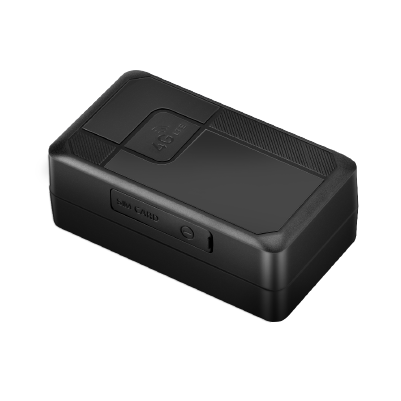

# Concox - LL702

The LL702 is a compact 4G Cat.1 GPS tracker from Concox built for long term asset monitoring and covert installation. It combines multi source positioning including GPS, BDS, LBS and Wi‑Fi hotspots with LTE Cat 1 communication and 2G GSM fallback to deliver location data across wide coverage areas. Designed for low maintenance, the device includes a high capacity industrial battery and a strong magnetic base for discreet mounting on metal assets.

As an out of the box Plaspy compatible device, the LL702 can feed persistent location and event data into Plaspy for fleet and asset management workflows. Its combination of long standby life, multi source positioning and onboard buffering makes it relevant for users who need reliable, low maintenance telemetry and alerting in Plaspy dashboards and reports.

## Key Highlights

- Plaspy compatible 4G Cat.1 tracker with 2G GSM fallback for broad cellular coverage.
- Long standby capability thanks to a 4,200 mAh industrial battery with multi year potential in power saving modes.
- Multi source positioning using GPS, BDS, LBS and Wi‑Fi hotspots to improve fix reliability in varied environments.
- Low profile and covert design with a strong magnetic base for secure hidden mounting on metal assets.
- Configurable working modes to balance reporting frequency and power consumption for extended deployments.
- Multi event alerts such as tamper via light sensor, low battery, geofence entry and exit, abnormal vibration and device removal.
- Onboard storage for position buffering when the device is temporarily out of cellular range.

## How It Works with Plaspy

When connected to Plaspy, the LL702 streams location fixes and event messages into the platform so operators can monitor assets in real time, receive alerts, and review historical activity. Plaspy ingests the device messages and presents them in maps, notifications, and reports while allowing configuration of reporting cadence and alert thresholds to suit operational needs.

- Real time location updates and visibility in Plaspy when the device is in tracking mode and has network connectivity.
- Tamper and light sensor alerts forwarded to Plaspy for anti theft monitoring and immediate response workflows.
- Geofence entry and exit notifications plus vibration and fall alerts for automated event handling and escalation.
- Buffered positions are uploaded once connectivity is restored, preserving history for Plaspy reports and playback.
- Configurable reporting modes to optimize battery life while maintaining the level of detail required by fleet or asset managers.

## Typical Use Cases

- Car rental and shared vehicle fleets that need concealed tracking with long intervals between maintenance.
- Auto finance and repossession monitoring where tamper detection and persistent location history aid recovery.
- Used car dealerships and auto traders requiring discreet telemetry for inventory oversight.
- Long term equipment and asset management programs that demand multi year standby and dependable geofencing alerts.

## Why Choose This Tracker with Plaspy

The LL702 pairs practical long battery life and discreet mounting with multi source positioning, making it a pragmatic choice for organizations that manage distributed, hard to access assets. Integrated with Plaspy, the device supports continuous visibility, automated alerts, and historical playback to simplify operational oversight and incident response without frequent device maintenance.

If you want to explore how the LL702 fits into your tracking program, learn more about Plaspy on the main website https://www.plaspy.com. Product specifications, availability, and manufacturer details can change over time, so verify current specifications on the manufacturer website https://www.iconcox.com/.
