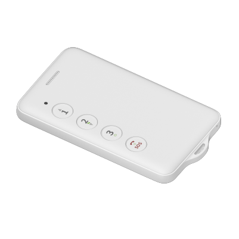

# Concox - PG201

The PG201 is a compact, intelligent personal GPS tracker designed for on-site personnel management and personal safety. It combines multi-system positioning, two-way communication and a dedicated SOS panic button in a lightweight, water-resistant form factor to help organizations monitor field staff, sanitation teams and other vulnerable workers during daily operations.

Because the PG201 is Plaspy compatible out of the box, it can stream location, motion and alert telemetry directly to the Plaspy cloud platform. That compatibility makes the device a practical choice when teams need centralized visibility, timely notifications and simple status reporting for workforce safety and basic tracking workflows.

## Key Highlights

- Plaspy compatible for seamless cloud reporting of location and alerts to a centralized management console
- Multi-system positioning (GPS + BDS + LBS) with a claimed position accuracy under 2.5 m CEP for precise personnel location
- Dedicated SOS panic button and two-way communication to accelerate emergency response and direct contact with personnel
- Lightweight, compact design (102.5 × 62.0 × 9.0 mm, approx. 70 g) with IPX5 water resistance for outdoor and semi-exposed environments
- Long battery standby from a 1,200 mAh Li‑Polymer cell with intelligent reporting modes to extend operational time
- Motion detection via a built-in accelerometer for activity monitoring and movement-based alerts
- Configurable alerts including SOS, geo-fence entry and exit, and low-battery notifications for proactive supervision

## How It Works with Plaspy

When integrated with Plaspy the PG201 sends GNSS and LBS-derived location data and status messages over the cellular network to the cloud. Plaspy displays device position on live maps, triggers notifications for SOS and geo-fence events, and records telemetry for reporting. Administrators can adjust reporting intervals and alert rules in Plaspy to balance tracking detail with battery life.

- Real-time location and telemetry updates shown on Plaspy maps for live situational awareness
- SOS and panic alerts with location details to support rapid incident response and escalation
- Motion detection events and inactivity alerts to help identify unusual behavior or stops
- Geo-fence notifications and scheduled or period-based reporting for coverage and attendance checks
- Two-way communication and contact coordination for direct outreach after alerts
- Low-battery and device status reporting so managers can plan maintenance and replacements

## Typical Use Cases

- Sanitation and street maintenance crews for route monitoring, attendance confirmation and SOS alerts
- Field staff and inspection teams for dispatch, location verification and scheduled check-ins
- Lone worker protection where panic button and two-way communication speed emergency response
- Construction site personnel monitoring to manage access and improve on-site safety
- Patrol and security teams needing configurable timing and instant location modes for coverage

## Why Choose This Tracker with Plaspy

The PG201 is purpose built for organizations that prioritize personnel safety, simple telemetry and fast emergency response rather than vehicle telematics. Its multi-constellation positioning and focused feature set deliver dependable location data and alerting that integrate cleanly into Plaspy’s maps, notifications and reporting tools. The compact form factor, water resistance and extended standby profile make it well suited for day-to-day field use.

To learn more about how the PG201 works with Plaspy visit https://www.plaspy.com for platform details and deployment guidance. Product specifications, availability and manufacturer information can change over time, so please verify the latest device details on the manufacturer website https://www.iconcox.com/.
