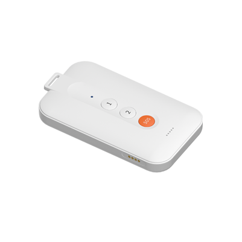

# Concox - PL200

The PL200 is a compact personal GPS tracker from Concox designed for field personnel and lone workers. It combines a rugged IP65 enclosure with long battery endurance, multi constellation positioning and two way voice plus SOS functionality. Lightweight and portable, the PL200 is intended for continuous tracking and rapid incident response in outdoor and mixed environment workflows.

As a Plaspy compatible device, the PL200 feeds real time location, status and emergency alerts into Plaspy’s dashboard and notification systems. That compatibility makes the device a practical choice for organizations that need dependable location intelligence, lone worker protection and straightforward mobile workforce oversight without sacrificing portability.

## Key Highlights

- Compact IP65 rated enclosure for outdoor use and easy carriage by field personnel.
- Long operational endurance suitable for multi day shifts under typical use scenarios.
- Two way voice and SOS panic button for direct communication and emergency escalation.
- Multi constellation positioning with Wi Fi and BLE assist to improve fix reliability in challenging areas.
- Configurable power modes and event alerts including low battery and geofence notifications.
- Lightweight form factor that supports mobile workforce and lone worker deployments.
- Built for rapid alerting and site level visibility when paired with a compatible tracking platform.

## How It Works with Plaspy

When deployed with Plaspy, the PL200 delivers live location updates, event alerts and voice capable communications into a centralized operational view. Plaspy ingests the device location and status information, enabling teams to monitor movements, receive SOS alerts and manage routine notifications through the Plaspy interface.

- Real time location and status updates appear on Plaspy maps and fleet views for operational visibility.
- SOS and panic alerts trigger configurable Plaspy notifications and escalation workflows.
- Two way voice and text to speech communications can be coordinated through Plaspy for direct contact with personnel.
- Geofence entry and exit events, low battery and SIM change alerts feed into Plaspy reporting and alert rules.
- BLE and Wi Fi assisted positions improve tracking accuracy in urban canyons or indoor fringe areas for better situational awareness.
- Remote configuration options let administrators adjust device behavior from management tools integrated with Plaspy.

## Typical Use Cases

- Lone worker protection programs requiring SOS alerts and direct voice contact.
- Mobile workforce management for sanitation, street maintenance and field crews.
- Security patrols and inspections where location history and geofence alerts are needed.
- Small to medium team tracking to optimize routes, attendance and task assignment.
- Sensor assisted presence or proximity workflows using BLE beacons or companion sensors.

## Why Choose This Tracker with Plaspy

The PL200 pairs portability and durability with features that matter for safety focused deployments. Its combination of assisted positioning, voice capability and configurable alerts makes it a natural fit for organizations that need reliable person level tracking and quick incident response. Integrated buffering and remote configuration help keep data flowing into Plaspy during brief connectivity gaps, supporting meaningful historical reports and operational continuity.

If you want to explore how the PL200 can support your team on Plaspy, learn more about Plaspy on the main website https://www.plaspy.com. Product specifications, availability and manufacturer details can change over time, so please verify current technical information and certifications on the Concox site https://www.iconcox.com/.
