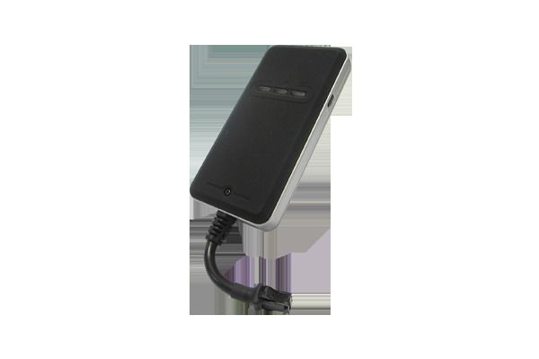

# Concox - TR02

The Concox TR02 is a compact GPS car tracking device with a built in antenna designed for straightforward vehicle locating and tracking. Positioned as an entry level solution from Concox, the TR02 emphasizes simplicity and affordability while offering practical features such as group management, geo fence notification, multiple account support, and basic status indicators for GPS, GSM, and power.

As a Plaspy compatible device, the TR02 fits naturally into vehicle monitoring and fleet workflows that prioritize ease of use and cost effectiveness. Its group and account features make it well suited to integrate with Plaspy for organized fleet views, geo fence alerts, and shared access among company users, enabling both individuals and businesses to add reliable tracked vehicles into the Plaspy platform.

## Key Highlights

- Built in antenna for a compact form factor and simple installation
- Designed for straightforward locating and tracking with an emphasis on ease of use
- Group management capability to organize multiple vehicles into logical sets
- Geo fence notifications to alert when a vehicle enters or exits a defined zone
- Support for multiple accounts to allow company user separation and shared access
- Lightweight and compact dimensions suitable for vehicle deployment
- Status LEDs for quick visual indication of GPS GSM and power state

## How It Works with Plaspy

When used with Plaspy, the Concox TR02 provides location updates and device status that Plaspy displays on its mapping and monitoring interfaces. Plaspy can consume the TR02 data to present vehicle movement, manage groups, and trigger notifications so teams can act on events in near real time.

- Live location and position history visible on Plaspy maps for tracking and review
- Group based organization inside Plaspy to mirror TR02 vehicle grouping and simplify fleet oversight
- Geo fence events forwarded to Plaspy so administrators receive entry and exit notifications
- Multi account handling to map TR02 users into company roles and controlled access in Plaspy
- Dashboard indicators and device status shown within Plaspy to monitor connectivity and power at a glance

## Typical Use Cases

- Small business fleet monitoring with basic grouping and alerting requirements
- Individual vehicle tracking for personal car security and location sharing
- Delivery or service vehicles where simple location updates and geo fence alerts are sufficient
- Rental or shared vehicle operations that need multi account access and oversight
- Organizations looking for a cost effective way to add vehicle assets to Plaspy

## Why Choose This Tracker with Plaspy

The Concox TR02 is a practical option for organizations and individuals who need a straightforward, budget conscious GPS tracking device that pairs well with a fleet platform like Plaspy. Its built in antenna, compact size, and simple management features reduce complexity while providing the core capabilities most users require for vehicle visibility.

Because the TR02 emphasizes group management, geo fence notification, and multi account support, it aligns with Plaspy workflows for organizing vehicles, delivering alerts, and sharing access among team members. For deployments where basic, reliable tracking and clear operational oversight are the primary goals, the TR02 offers a sensible balance between capability and cost within the Plaspy ecosystem.

To learn more about Plaspy and how compatible trackers like the Concox TR02 can be used for vehicle tracking and fleet monitoring visit https://www.plaspy.com. Product specifications, availability, and manufacturer details can change over time, so verify current technical specifications and support information on the manufacturer site https://www.iconcox.com/.
