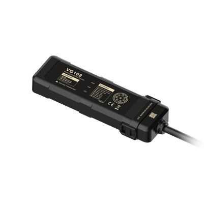

# Concox - VG102

The Concox VG102 is a compact GNSS GPS tracker purpose built for motorcycles and two wheeler fleets. It offers positioning, event alerts, and anti theft controls in a small, rugged package with an IP66 rated enclosure and an internal backup battery. The design and feature set make the VG102 suitable for operations that require discreet mounting, reliable outdoors performance, and continuous monitoring of two wheeler assets.

As a Plaspy compatible device, the VG102 can feed position, status, and event data into Plaspy dashboards and workflows. When paired with Plaspy, the tracker’s telemetry and onboard alerts support centralized visibility, automated notifications, and practical recovery workflows—helping lending institutions, leasing companies, and fleet managers monitor and protect motorcycle assets.

## Key Highlights

- Purpose built for motorcycles and two wheeler fleets with a compact form factor for discreet placement.
- High sensitivity GNSS for reliable position updates suitable for real time tracking and historical playback.
- Built in relay for remote immobilization to support anti theft and recovery procedures.
- Multiple event alerts including tip over, tamper, vibration, SOS, geo fence entry and exit, and low battery notifications.
- IP66 rated housing and internal backup battery for resilient operation in harsh road and weather conditions.
- Optional plug and track adapter cable to simplify damage free installation on common motorcycle models.
- Low standby current and intelligent power management to preserve tracking during vehicle power interruptions.

## How It Works with Plaspy

When the VG102 is connected with Plaspy, its position and event data are transmitted to the platform where Plaspy normalizes and presents that information on maps, reports, and rule based alerts. Plaspy uses those inputs to provide operational oversight, automated notifications, and tools to coordinate recovery or maintenance actions.

- Real time location and movement updates shown on Plaspy maps and live monitoring views.
- Event driven alerts such as tip over, tamper, SOS, and geo fence triggers routed into Plaspy workflows for rapid response.
- Remote immobilization control integrated into Plaspy command channels to assist in recovery and anti theft procedures.
- Device health and low battery notices surfaced in Plaspy for proactive maintenance and uptime management.
- Historical tracking and reports available for compliance, auditing, and performance analysis.

## Typical Use Cases

- Mortgage and collateral protection for two wheel vehicles where continuous tracking and remote cut off support recovery.
- Leasing and rental fleets that need discreet tracking, policy enforcement, and event based notifications.
- Dealerships protecting inventory and monitoring test rides with tamper and vibration alerts.
- Urban delivery and last mile services seeking compact installation combined with centralized route oversight.
- Fleet operations that require consistent reporting into a single platform for dispatch and recovery coordination.

## Why Choose This Tracker with Plaspy

The VG102 is a focused option for organizations that need a rugged, discreet tracker for motorcycles and small vehicles. Its combination of GNSS positioning, event alerts, remote immobilization capability, and IP66 protection makes it a practical fit where reliable asset visibility and theft mitigation are priorities. Paired with Plaspy, the VG102 contributes position and status data into unified dashboards and workflows that support monitoring, reporting, and recovery actions.

If your program values compact hardware that integrates into a central fleet management system, the VG102 is engineered to deliver core tracking and security features while Plaspy supplies the platform for visibility, rules, and operational follow up. Learn more about Plaspy on the main website https://www.plaspy.com. Product specifications, availability, and manufacturer details can change over time so please verify the current technical information on the official manufacturer site https://www.iconcox.com/ before making purchasing or deployment decisions.
