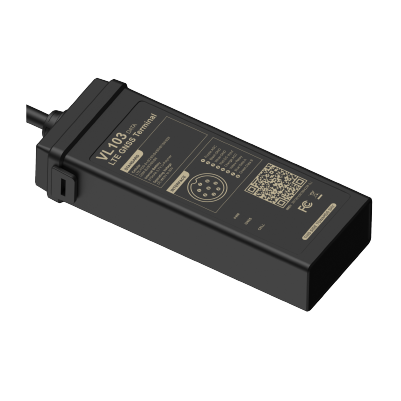

# Concox - VL103D

The Concox VL103D is a compact LTE GNSS vehicle terminal designed for discreet installation in motorcycles, passenger cars and light commercial vehicles. It combines road ready hardware with cellular connectivity to provide continuous real time tracking, rapid position fixes and the vehicle telemetry commonly required for recovery, anti theft workflows and basic fleet oversight.

As a Plaspy compatible device out of the box, the VL103D can stream GNSS positions and vehicle telemetry directly into Plaspy for live maps, alerts and historic route playback. That native compatibility makes the device a practical choice for operators who want a compact, rugged tracker that integrates with Plaspy for monitoring and operational workflows.

## Key Highlights

- Plaspy compatible vehicle tracker that integrates GNSS positions and telemetry into the Plaspy platform for real time visibility and alerts.
- Compact rugged design suitable for discreet mounting on motorcycles and small vehicles with IP66 dust and water resistance.
- Reliable cellular connectivity with LTE and 2G fallback to maintain continuity of tracking across coverage conditions.
- Wide operating voltage range and an onboard industrial backup battery for use across diverse vehicle electrical systems.
- Integrated motion sensing for movement detection and driving behaviour telemetry useful for recovery and safety reporting.
- Analog input and configurable digital inputs and outputs enable basic vehicle sensor integration and remote cut off workflows.
- Fast position fixes and high sensitivity GNSS performance to support prompt location updates and route reconstruction.

## How It Works with Plaspy

When connected to Plaspy, the VL103D transmits GNSS fixes and vehicle telemetry so Plaspy can display live locations, generate alerts, and store historical data for reporting. Plaspy ingests the device data and applies configurable rules and notifications to support fleet monitoring, anti theft response, and operational reporting.

- Continuous location updates feed Plaspy live maps and situational dashboards for fleet oversight.
- Event reporting such as movement, geo fence triggers and battery status become alerts inside Plaspy for timely action.
- Ignition status and remote cut off outputs can be reflected in Plaspy workflows for immobilization and recovery coordination.
- Analog sensor inputs are available to bring vehicle sensor readings into Plaspy reports and telemetry views.
- Accelerometer based harsh event notifications can populate driver safety reports and incident logs within Plaspy.

## Typical Use Cases

- Stolen vehicle recovery and immobilization workflows for cars and motorcycles when monitored through Plaspy.
- Light commercial fleet tracking where compact hardware and robust connectivity are needed for continuous visibility.
- Driver behaviour monitoring and safety reporting using motion event data to support coaching and compliance.
- Remote monitoring of analog vehicle sensors such as fuel level integrated into telematics reporting.
- Discreet installations on motorcycles and small vehicles requiring a low profile IP66 rated tracker.

## Why Choose This Tracker with Plaspy

The VL103D offers a pragmatic balance of compact form factor, rugged build and continuous cellular connectivity that fits many light vehicle tracking deployments. Its native compatibility with Plaspy simplifies device onboarding and brings position, event and sensor data into a single platform for operational oversight and reporting.

If you are evaluating devices for recovery, basic fleet management or discreet vehicle monitoring, the VL103D paired with Plaspy provides an integrated solution for live tracking and event driven workflows. Learn more about Plaspy on the main website https://www.plaspy.com. Product specifications, availability and manufacturer details can change over time, so please verify current specifications on the manufacturer website https://www.iconcox.com/.
