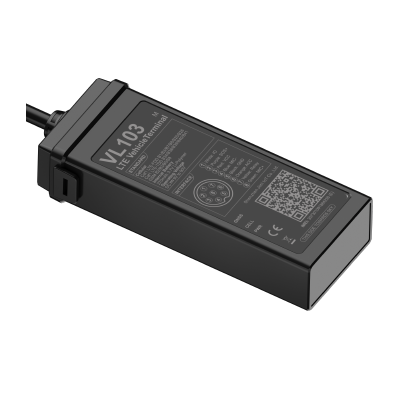

# Concox - VL103M

The VL103M from Concox is a compact, rugged 4G GPS tracker designed for motorcycles and light commercial vehicles. Purpose built for continuous location updates and event driven reporting, it combines multi constellation GNSS positioning with cellular communications to provide real time tracking, anti theft alerts and practical telemetry for fleet and rental operations.

Because the VL103M is Plaspy compatible out of the box, it can be integrated into Plaspy's real time tracking and fleet management workflows without custom protocol work. That compatibility brings the device's location, motion and alert data into Plaspy so operators can monitor assets, receive notifications and run reports within a unified platform.

## Key Highlights

- Plaspy compatible for straightforward integration into real time tracking and fleet workflows
- Compact, rugged IP66 rated housing suited to motorcycles and small vehicles
- Multi constellation GNSS positioning with high accuracy for precise location reporting
- Cellular connectivity with fallback for continuous updates and event driven reports
- Remote listen in plus relay output for buzzer or horn to assist audible locating and warnings
- Vibration, tamper and low voltage detection for proactive anti theft alerts and asset protection

## How It Works with Plaspy

The VL103M sends position updates and event reports to Plaspy so operators can view live locations, replay history and configure alerts from a single dashboard. Plaspy ingests the device telemetry and exposes it in map views, notification streams and reporting tools that match operational needs.

- Real time location and map visualization inside Plaspy for live fleet oversight
- Event driven notifications such as vibration, geo fence entry or tamper reported directly to Plaspy
- Low voltage and digital input statuses available to trigger battery protection alerts and emergency workflows
- Remote listen in audio and relay control usable as part of Plaspy alarm responses
- Onboard data buffering allows delayed uploads to Plaspy after temporary connectivity loss

## Typical Use Cases

- Fleet management of motorcycles and light commercial vehicles with route playback and operational alerts
- Vehicle rental monitoring to enforce geofences and protect against battery issues
- Stolen vehicle recovery workflows using tamper, vibration alerts and remote audio plus audible locating
- Safety and emergency response with SOS input and immediate dispatch notifications via Plaspy
- Telemetry enabled maintenance planning when combined with Plaspy reporting and analytics

## Why Choose This Tracker with Plaspy

The VL103M offers a compact form factor and a durable enclosure that suit two wheeled and small vehicle deployments where space and resilience matter. Its combination of multi constellation GNSS positioning, event based alerts and audible locating outputs makes it a practical choice for teams that need dependable tracking and anti theft capabilities integrated into a fleet management platform.

Paired with Plaspy, the VL103M brings those device level events and location updates into a single operational view, simplifying monitoring, alerts and recovery workflows. To learn more about how Plaspy supports devices like the VL103M visit https://www.plaspy.com. Product specifications, availability and manufacturer details can change over time, so please verify current specifications with the manufacturer at https://www.iconcox.com/.
