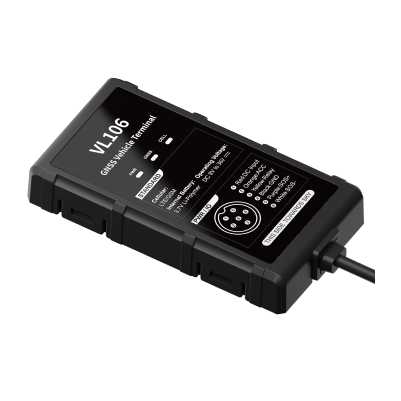

# Concox - VL106

The VL106 is a Plaspy compatible GPS tracker engineered for demanding vehicle deployments where continuous, accurate location and motion data are essential. Combining an INS‑aided navigation solution with multi‑constellation GNSS \(GPS/BDS/GLONASS/Galileo\), the VL106 maintains high positioning accuracy and reliable tracking performance in tunnels, underground parking, and other GNSS‑challenging environments. Its compact, rugged design and automotive‑grade power range make it ideal for fleet management, usage‑based insurance \(UBI\), auto finance and anti‑theft applications.

Designed to integrate seamlessly with the Plaspy platform, the VL106 delivers real‑time tracking, rich telemetry and event reporting to help operators reduce risk, improve safety and optimize operations. Built‑in ignition/ACC detection, a relay for remote fuel/power cut‑off, high‑rate IMU capture for collision analysis, and onboard storage ensure continuous data capture even during connectivity interruptions—making the VL106 a practical GPS tracker choice for professional fleet and security deployments.

## Key Highlights

- INS‑aided GPS tracker performance for continuous, accurate positioning in GNSS‑degraded environments.
- Plaspy compatible for real‑time tracking, alerts and fleet management dashboards.
- High positioning accuracy \(＜2.0 m CEP\) with fast hot start and cold start times for dependable location fixes.
- Integrated IMU \(3‑axis accelerometer and 3‑axis gyroscope\) enabling driving behavior analysis, collision detection, and telemetric insights.
- Automotive I/O including ACC/ignition detection, SOS/panic button and relay output for remote immobilizer or fuel/power cut‑off.
- Rugged, compact form factor with wide input voltage \(9–36 VDC\) and IP65 protection for harsh vehicle environments.
- Onboard storage and a small backup battery to preserve critical event data if connectivity is lost.

## How It Works with Plaspy

When paired with Plaspy, the VL106 streams location, motion and event telemetry to Plaspy's real‑time platform where data is visualized, analyzed and converted into actionable alerts and reports. Plaspy ingests vehicle GNSS and IMU data to power live maps, historical replay, driving behavior reports and automated event workflows for fleet management and anti‑theft response.

- Real‑time location and telemetry updates for live fleet tracking.
- ACC/ignition detection and SOS/panic status reported instantly to Plaspy.
- Fuel/power cut‑off via relay output usable for remote immobilizer commands through Plaspy workflows.
- High‑rate IMU upload \(20 Hz for 10 seconds around impacts\) to support collision reconstruction and post‑incident analysis.
- Onboard storage retention ensures that critical events are available to Plaspy after temporary signal loss; Plaspy can combine VL106 telemetry with external sensor feeds such as Bluetooth sensors managed through the Plaspy platform.

## Technical Overview

| Connectivity | LTE and GSM cellular connectivity for global communication |
| --- | --- |
| Bands | Not specified \(LTE/GSM supported\) |
| Power & Battery | Wide input voltage 9–36 VDC; onboard backup battery 100 mAh, 3.7 V Li‑Polymer |
| Interfaces | ACC/ignition detection, SOS/panic button, relay output for remote fuel/power cut‑off, Micro‑SIM slot |
| GNSS | Multi‑constellation: GPS / BDS / GLONASS / Galileo; positioning accuracy &lt;2.0 m CEP; hot start ≤1 s, cold start ≤24 s; tracking sensitivity -165 dBm, acquisition sensitivity -148 dBm |
| IMU / Sensors | Integrated 3‑axis accelerometer and 3‑axis gyroscope; collision event recording and 20 Hz IMU capture for 10 s pre/post impact |
| Storage | Onboard storage 128 + 128 Mb |
| Remote Management | Not specified \(device supports remote event reporting; check vendor for FOTA/management tools\) |
| Form Factor & Environment | Compact: 94.3 x 50.4 x 15.0 mm; IP65; operating temperature -20℃ to +70℃ |
| Typical Installation | Vehicle installation; industrial/automotive use |

## Use Cases

- Fleet management: continuous real‑time tracking, driver behavior telemetry and automated reporting to improve utilization and reduce operating costs.
- Usage‑based insurance \(UBI\): accurate driving behavior monitoring \(harsh acceleration/braking, cornering, rollover\) to support risk profiling and insurer analytics.
- Auto finance and repossession: remote immobilizer capability via relay output for secure recovery workflows and theft deterrence.
- Collision investigation and safety: high‑rate IMU data capture and pre/post impact logs for accident reconstruction and liability analysis.
- Anti‑theft and security: instant alerts for tampering, power supply disconnection and geo‑fence violations combined with Plaspy‑driven response actions.

## Why Choose This Tracker with Plaspy

The VL106 offers a robust, INS‑aided GPS tracker solution for organizations that require reliable location continuity and rich telemetry in real‑world driving conditions. Its multi‑constellation GNSS, high sensitivity receiver and integrated IMU deliver precise position and motion data where standard GNSS trackers can fail. Paired with Plaspy, operators gain a Plaspy compatible solution that converts this raw telemetry into real‑time tracking, fleet management insights and automated anti‑theft actions—supporting fuel monitoring workflows, ignition and immobilizer controls, and detailed driving behavior analytics. For fleets, insurers and finance providers seeking accurate tracking, event fidelity and seamless platform integration, the VL106 with Plaspy provides a practical, scalable option without compromising on environmental robustness or vehicle‑grade interfaces.

