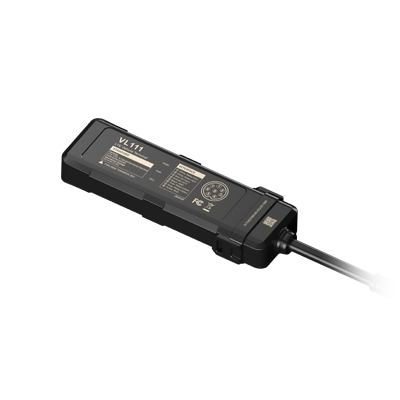

# Concox - VL111

The Concox VL111 is a compact 4G LTE vehicle GPS tracker designed for discreet, reliable real time tracking of motorcycles and light vehicles. Offered in regional variants such as VL111S_LA and VL111S_EM, the model combines multi constellation GNSS positioning, LTE Cat 1 connectivity with 2G fallback, BLE 5.0 and an onboard relay for remote immobilization. Its small form factor, IP66 rugged housing and internal battery fallback make it suitable for installations where space and durability matter.

As a Plaspy compatible device, the VL111 supplies location, trip history and core vehicle telemetry that Plaspy uses for live monitoring, alerts and reporting. The tracker’s telemetry and control features, including remote relay control and battery protection, map naturally into Plaspy workflows for fleet oversight, anti theft protection and operational reporting without requiring users to extrapolate unsupported capabilities.

## Key Highlights

- Compact, lightweight tracker built for motorcycles and light vehicles with a rugged IP66 enclosure for outdoor use.
- Multi constellation GNSS positioning to support accurate location reporting and trip playback.
- LTE Cat 1 connectivity with 2G fallback for continuous telemetry reporting in varied coverage conditions.
- Onboard relay for remote immobilization to support anti theft workflows and dealer vehicle control scenarios.
- Internal battery fallback and automatic power disconnect to protect vehicle battery during extended idle periods.
- BLE 5.0 support for proximity or sensor integrations and accelerometer driven driving event detection.

## How It Works with Plaspy

When configured with Plaspy, the VL111 forwards periodic GNSS positions, telemetry and event data so fleet managers and dispatchers can view live location, review trip history and receive alerts from a single platform. Plaspy consumes the device data to provide operational visibility, reporting and remote command options where supported.

- Real time location and trip playback in Plaspy for route visibility and historical review.
- Remote immobilizer control via the onboard relay where device connectivity and permissions allow Plaspy to issue commands.
- Vehicle health and battery monitoring with alerts for low internal backup or abnormal vehicle voltage conditions.
- Driving behavior and safety event reporting based on accelerometer signals for coaching and incident review.
- BLE sensor and proximity context available to enrich asset data when paired with compatible accessories.

## Typical Use Cases

- Fleet management for light commercial vehicles and motorcycles requiring continuous location and trip reporting.
- Anti theft protection and dealer inventory control using remote immobilization and tamper alerts.
- Battery protection programs that prevent vehicle battery drain during long idle periods with automatic power disconnect.
- Safety and compliance programs that use event reporting for driver coaching and incident analysis.
- Discrete installations for rental fleets and dealers that need unobtrusive telemetry and control.

## Why Choose This Tracker with Plaspy

The VL111 pairs practical telemetry and control features with a compact, rugged design that fits many light vehicle and motorcycle deployments. Its built in relay, internal backup and power protection features make it particularly useful for organizations focused on anti theft measures and long term vehicle monitoring, while multi constellation positioning and cellular fallback help maintain reliable tracking in mixed coverage environments.

Using the VL111 with Plaspy gives teams consolidated access to live location, driver events, battery and vehicle telemetry and remote control capabilities within a single fleet management platform. This combination helps reduce operational complexity for managers who need dependable tracking and simple oversight across a dispersed set of light vehicles and two wheeled assets.

Learn more about Plaspy and how compatible devices like the VL111 integrate with our platform by visiting https://www.plaspy.com. Product specifications, availability and manufacturer details can change over time; please verify the latest information and technical specifications on the official manufacturer site https://www.iconcox.com/.
