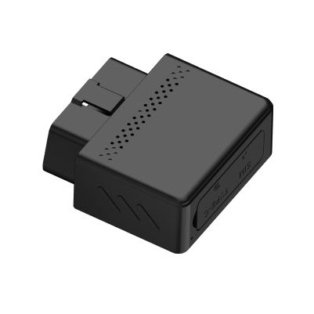

# Concox - VL512

The Concox VL512 is a compact OBDII 4G GPS tracker designed for fast plug and play installation in passenger cars. It combines satellite positioning with on device motion sensing and a discreet microphone to deliver continuous location and event telemetry. The VL512 is built for straightforward deployment across vehicle fleets and for applications that require reliable real time tracking and event alerts.

As a Plaspy compatible device, the VL512 feeds location updates, motion events and alert messages into Plaspy so operators can monitor vehicles, review historical routes and configure notifications from a single platform. Its design and telemetry features make it a practical choice for organizations that want quick device rollout alongside Plaspy’s dashboards, reporting and operational oversight.

## Key Highlights

- Plug and play OBDII form factor for rapid deployment in passenger vehicles.
- LTE first connectivity with GSM fallback to help maintain data delivery across coverage areas.
- GPS plus BDS positioning with high accuracy for dependable real time location.
- Integrated motion sensors for driving behavior events and collision detection.
- Instant alerts for movement, geo fence entry and exit, speeding and power disconnection.
- Built in microphone for remote voice monitoring and a small backup battery for power loss reporting.

## How It Works with Plaspy

When connected to Plaspy, the VL512 transmits periodic position and event data so the platform can present live locations, trigger alerts and retain historical records for analysis. Plaspy ingests the tracker telemetry and maps device events into fleet dashboards, notifications and exportable reports useful for operations and safety monitoring.

- Real time location updates and route reconstruction for active fleet visibility.
- Event driven alerts such as movement, geo fence crossings and power disconnection.
- Driving behavior insights from motion events to support safety programs and analytics.
- Ignition and power state indicators to help verify engine on and engine off status.
- Historical reporting and exportable telemetry to support operations, compliance and insurance workflows.

## Typical Use Cases

- Fleet management for passenger cars requiring fast installation and centralized monitoring.
- Anti theft and recovery workflows using movement, geo fence and power loss alerts.
- Usage based insurance and driver scoring programs that rely on behavior events.
- Rental and car sharing operations that need quick onboarding and incident evidence.
- Dispatch and roadside assistance where immediate vehicle state and location are critical.

## Why Choose This Tracker with Plaspy

The VL512 pairs easy deployment with a set of telemetry features that map well to Plaspy’s monitoring and reporting capabilities. Its compact OBDII design and built in sensors supply the core location and event data fleet operators need to maintain visibility, manage safety programs and respond to incidents without complex hardware changes.

If you are evaluating compact vehicle trackers for scalable fleet tracking, anti theft monitoring or usage based telematics, the VL512 is a practical option to consider alongside Plaspy. Learn more about Plaspy on the main website https://www.plaspy.com and verify current product specifications and availability on the manufacturer site https://www.iconcox.com/. Product specifications and availability can change over time so please confirm details with the official manufacturer documentation.
