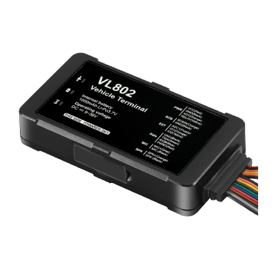

# Concox - VL802

The VL802 is a compact LTE vehicle terminal engineered for industrial and commercial fleet management. It is designed to provide rugged, network resilient performance for passenger cars, trucks and buses, delivering reliable real time tracking, rich telemetry and two way control functions that fleet operators and integrators rely on. The device combines multi constellation GNSS positioning with wideband cellular connectivity and a set of vehicle oriented inputs and outputs for practical telematics deployments.

Because the VL802 is Plaspy compatible out of the box, it can act as a central telematics node within a Plaspy deployment. When paired with Plaspy the VL802 streams location, telemetry and event notifications so operators gain visibility, automated alerts and historical reporting for fleet oversight, anti theft workflows and sensor based monitoring. This compatibility helps reduce integration time and lets teams use Plaspy features for monitoring and operational control.

## Key Highlights

- Plaspy compatible terminal offering LTE connectivity with 2G fallback for continuous tracking in mixed coverage areas.
- Multi constellation GNSS positioning for dependable location accuracy in vehicle applications.
- Built for continuous operation across vehicle types with an industrial power range and onboard backup battery for resilience.
- Extensive I O set including ignition detection, relay output for immobilizer control and analog inputs for sensor telemetry.
- Onboard motion sensing and event reporting to support alerts for speeding, vibration, SOS and other incidents.
- Two way audio and remote listen in capabilities to assist incident verification and passenger or driver safety.
- Bluetooth support for quick local configuration and accessory pairing to simplify field setup.

## How It Works with Plaspy

When integrated with Plaspy the VL802 streams position and telemetry over its cellular link so fleet managers see live locations and vehicle status in the Plaspy dashboard. Plaspy ingests GNSS coordinates, telemetry and event notifications and converts them into alerts, historical reports and workflow actions that support fleet operations and security processes.

- Real time location and telemetry updates feed Plaspy for live tracking and map based visibility.
- Ignition and digital input events such as SOS and door status are delivered to Plaspy for alerting and ignition based reporting.
- Analog input telemetry can be used to present fuel or sensor values within Plaspy dashboards and reports.
- Remote relay control and cut off commands are available through Plaspy to support anti theft and immobilization workflows.
- Two way audio and remote listen in provide additional context for incidents and can be linked to Plaspy alerts for verification.
- Bluetooth based local configuration simplifies on site setup before or after device activation in Plaspy.

## Typical Use Cases

- Commercial fleet management for routing, scheduling and driver performance monitoring.
- Anti theft and recovery workflows using remote immobilization and event driven alerts.
- Public transport and passenger services for real time locations, SOS handling and operational oversight.
- Telematics for insurance and driver scoring using event and behavior data captured by the device.
- Sensor telemetry and fuel monitoring using analog inputs and external sensor integration for operational dashboards.

## Why Choose This Tracker with Plaspy

The VL802 offers a practical combination of rugged hardware and flexible interfaces that make it a strong fit for organizations using Plaspy. Its focus on continuous operation, multi constellation positioning and extensive vehicle I O supports common fleet needs such as location tracking, immobilizer control and sensor telemetry without requiring bespoke hardware changes. For integrators and fleet operators, the device provides the telemetry primitives Plaspy needs to deliver alerts, reports and automated responses.

Because the VL802 is designed for industrial and commercial deployments, it pairs naturally with Plaspy to scale from single vehicle installations to larger fleets while supporting anti theft, safety and operational reporting use cases. If you are evaluating Plaspy compatible devices, the VL802 is a practical option to consider for fleets that need resilient connectivity and a broad set of I O capabilities.

Learn more about Plaspy and how compatible devices like the VL802 can support your fleet on the Plaspy website https://www.plaspy.com. Product specifications and availability can change over time, so please verify current details with the manufacturer at https://www.iconcox.com/.
