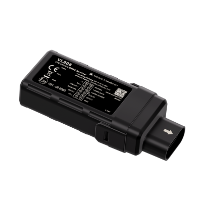

# Concox - VL808

The VL808 is a hardwired LTE vehicle GNSS terminal engineered for reliable fleet and vehicle tracking in demanding environments. It is built with industrial-grade protection and multi GNSS positioning that delivers sub 2.5 m CEP accuracy, plus onboard telemetry such as an accelerometer, flexible I O options and BLE accessory support to cover a wide range of vehicle monitoring needs.

As a Plaspy compatible device, the VL808 streams location, event and sensor data into the Plaspy platform to enable real time visibility, alerts and reporting. Its robust connectivity, offline logging and vehicle oriented inputs make it a practical choice for organizations that want dependable asset tracking, driver behavior insights and integrations through Plaspy without sacrificing durability.

## Key Highlights

- Plaspy compatible vehicle tracker offering reliable real time position reporting and event streaming.
- LTE Cat 1 connectivity with GSM fallback for widespread data transmission and persistent connectivity.
- Multi GNSS positioning with listed accuracy under 2.5 m CEP for precise location reporting.
- Industrial IP67 enclosure and wide operating temperature range for harsh vehicle environments.
- Flexible I O and BLE accessory support for fuel, door, ignition and peripheral sensor integration.
- Onboard accelerometer for telemetry and driving behavior events such as harsh accelerations and collisions.
- Wide vehicle input voltage compatibility and internal backup battery plus offline logging to preserve data during network gaps.

## How It Works with Plaspy

When connected to Plaspy, the VL808 delivers continuous position updates, telemetry and event notifications so operators can monitor vehicle status, respond to incidents and run historical reports. Plaspy ingests the VL808 data and presents it through live maps, alerts and dashboards for operational oversight and reporting.

- Live location and history playback to track routes and view recent trips.
- Event and alarm notifications for ignition, door or accelerometer based alerts, enabling rapid response.
- Analog and digital input states visible in Plaspy for monitoring fuel sensors, door status and battery voltage.
- BLE accessory data and paired peripheral signals that appear as supplementary telemetry in Plaspy.
- Offline log synchronization that uploads stored entries to Plaspy when connectivity is restored.

## Typical Use Cases

- Commercial fleet management and route monitoring with driver behavior analysis and trip reporting.
- Anti theft and immobilization workflows where location and digital outputs support response actions.
- Fuel level and battery health monitoring using analog inputs and wide voltage detection.
- Temperature sensitive or proximity scenarios using BLE sensors and beacons for refrigerated cargo or driver ID.
- Insurance telematics and small vehicle tracking where compact, durable hardware and accelerometer events are required.

## Why Choose This Tracker with Plaspy

The VL808 combines rugged hardware and versatile I O with the operational visibility and rule based workflows available in Plaspy. Its multi GNSS accuracy, resilient connectivity and offline logging help keep vehicles visible and data flowing in challenging conditions, while accelerometer events and input monitoring feed Plaspy alerts and analytics that support safety and asset protection.

If you want to learn more about how the VL808 can work with Plaspy for fleet tracking and telematics, please visit the Plaspy main website at https://www.plaspy.com for platform details and next steps. Product specifications, availability and manufacturer details can change over time, so verify current technical information on the official Concox site at https://www.iconcox.com/.
