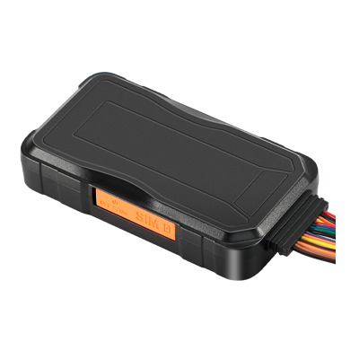

# Concox - WeTrack140

The WeTrack140 is an AIS140 approved multifunctional vehicle GPS tracker designed for the Indian market. It provides continuous real time location tracking together with distance and speed monitoring, and exposes a range of telematics and status inputs suitable for vehicle level oversight. The device is described as resilient for automotive use, with protection against dust and water, backup power, and features aimed at operational control and safety.

As a Plaspy compatible device, the WeTrack140 is intended to integrate with centralized fleet management workflows to deliver live location visibility, route playback, alerts and reporting. That compatibility makes it relevant for organizations using Plaspy who require regulatory compliance, vehicle control features and consolidated telematics within a single management platform.

## Key Highlights

- AIS140 approval for deployments that require Indian regulatory compliance and standardized telemetry.
- Compatible with Plaspy for centralized fleet monitoring, reporting and alerting.
- Multi constellation GNSS positioning for resilient vehicle location tracking.
- Operational control features including remote cut off and a panic button for emergency alerts.
- Driving behavior analysis and collision detection to support safety programs and operational insight.
- Voice monitoring and remote listen in for situational awareness when needed.
- Rugged IP66 design and onboard storage to preserve records during interruptions.

## How It Works with Plaspy

When paired with Plaspy, the WeTrack140 streams GNSS positioning and vehicle status into the platform to enable live monitoring, historical playback and event driven notifications. Plaspy ingests the tracker telemetry and status inputs to populate dashboards, trigger alerts and produce routine or ad hoc reports for fleet operators.

- Real time location updates with speed and distance measurements for live fleet visibility.
- Vehicle status inputs such as door or ignition style signals to validate stops and asset state.
- Remote cut off capability integrated into Plaspy alerts and workflows for asset protection.
- Panic button and voice monitoring events forwarded to Plaspy for incident response.
- Driving behavior and collision events recorded and analyzed within Plaspy for coaching and compliance.
- Historical records and route playback available in Plaspy to support investigations and reporting.

## Typical Use Cases

- Government and municipal fleets requiring AIS140 compliance and centralized telemetry reporting.
- Courier and last mile delivery operations needing real time tracking and stop verification.
- Car rental and shared mobility services that benefit from remote control features and driving analytics.
- Logistics and distribution fleets seeking route playback, mileage tracking and driver performance insights.
- Anti theft and recovery scenarios using panic alerts, remote cut off and live location data.

## Why Choose This Tracker with Plaspy

The WeTrack140 is a practical choice for organizations that need an AIS140 approved tracker with a mix of regulatory alignment, operational controls and telematics. Its combination of resilient positioning, status inputs and built in safety features supports typical fleet management requirements without adding unnecessary complexity. For teams using Plaspy, the device delivers the kinds of telemetry and event signals that feed dashboards, alerts and automated reports useful in day to day fleet operations.

To learn more about how Plaspy can work with Concox devices like the WeTrack140 visit https://www.plaspy.com. Product specifications, availability and related manufacturer details can change over time, so please verify current specifications on the official Concox site https://www.iconcox.com/ before finalizing procurement or deployment plans.
