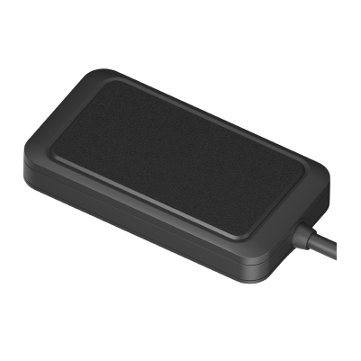

# Concox - WeTrack2

The WeTrack2 is a compact vehicle GNSS tracker designed for e-scooters, motorcycles, light vehicles and industrial equipment. Built to industrial electronics standards with an IP65 rated enclosure and a wide 9–90 VDC operating range, the WeTrack2 provides continuous position reporting, event detection and anti theft controls in a small, rugged package suitable for demanding field use.

As a Plaspy compatible device, the WeTrack2 streams location and essential telemetry into Plaspy for live dashboards, alerts and historical reporting. Its onboard backup battery, local data buffering and ignition detection make it well suited to Plaspy deployments that require reliable visibility, remote immobilizer control and fast response to theft or operational incidents.

## Key Highlights

- Designed for scooters motorcycles light vehicles and industrial equipment with a compact IP65 enclosure.
- Wide 9–90 VDC operating range for compatibility with diverse vehicle classes and equipment.
- Remote immobilizer support via external relay for fuel or power cut off to aid theft response.
- High sensitivity GNSS positioning with sub 2.5 m positional accuracy for precise location tracking.
- Low power design with onboard backup battery and local data buffering to preserve reporting during short outages.
- Accelerometer based event detection for movement alerts over speed events and driving incident notifications.

## How It Works with Plaspy

When integrated with Plaspy, the WeTrack2 forwards location fixes, event triggers and status changes into the Plaspy platform so teams can monitor assets in real time and act on alerts. Plaspy translates incoming telemetry into geofences, speed and ignition events, historical traces and operational dashboards that improve oversight and recovery workflows.

- Live location updates and replay of historical tracks for route analysis and incident reconstruction.
- Ignition detection reported to Plaspy to indicate vehicle on and off status and to drive workflows.
- Movement over speed and geofence entry and exit alerts for proactive fleet supervision and driver coaching.
- Remote immobilizer control accessible from Plaspy for coordinated anti theft response where supported.
- Local buffering and backup battery help maintain data continuity and reporting during brief connectivity interruptions.

## Typical Use Cases

- Stolen vehicle recovery for motorcycles scooters and other lightweight vehicles using live tracking and remote immobilizer control.
- Fleet management for light vehicles and utility carts where compact hardware and wide voltage tolerance are required.
- Scooter and motorcycle sharing platforms that need continuous telemetry and simple integration for many devices.
- Tracking industrial equipment and small machinery with wide operating voltage ranges and outdoor rated housings.
- Operational monitoring where ignition state route history and event alerts feed dashboards and reports.

## Why Choose This Tracker with Plaspy

WeTrack2 provides a practical balance of ruggedness compact size and the core telemetry features fleet operators commonly need. Its tolerance for a wide input voltage range, IP65 protection and onboard buffering make it a resilient option for mixed fleets and outdoor deployments, while ignition detection and remote immobilizer support add important anti theft capabilities.

Paired with Plaspy, WeTrack2 becomes part of an operational toolset for live monitoring alerts and reporting that helps teams respond faster to incidents and maintain continuous visibility across assets. For full specifications and the latest manufacturer details please refer to the official Concox documentation.

To learn more about Plaspy and how compatible trackers are used on the platform visit https://www.plaspy.com. Product specifications availability and manufacturer details can change over time so verify current information with the official manufacturer website https://www.iconcox.com/.
