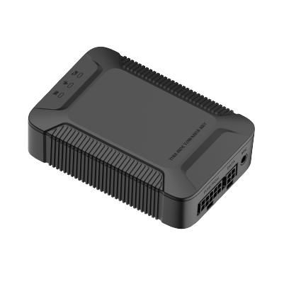

# Concox - X3

The Concox X3 is a compact, multifunctional vehicle GPS tracker built for reliable real time tracking, fleet management and security monitoring. Designed for vehicle installations, the X3 combines GNSS positioning (GPS, BDS and LBS), two way communication and driving behavior analytics to help fleets monitor location, respond to incidents and improve driver safety.

As a device compatible with Plaspy, the X3 feeds live telemetry and event data into Plaspy dashboards and workflows so operators can monitor vehicles, trigger alerts and take remote actions when needed. Its flexible peripheral interfaces and wide input voltage range make the X3 an adaptable option for fleet operators, logistics providers and security installations that want centralized visibility through Plaspy.

## Key Highlights

- Compact vehicle tracker tailored for real time fleet monitoring and security integration.
- GNSS positioning using GPS, BDS and LBS for precise location reporting.
- Two way communication and in cab voice monitoring to support incident verification and driver contact.
- Driving behavior analytics for harsh acceleration, braking and cornering to support safety programs.
- Flexible I O and relay outputs for remote control and integration with vehicle systems.
- Wide 9 to 36 VDC input range suitable for a variety of vehicle types.

## How It Works with Plaspy

When connected to Plaspy, the X3 streams location updates, event signals and driving behavior events into a single fleet management interface. Plaspy ingests the X3 telemetry to provide map visualization, alerting, historical reports and operational workflows that help teams respond faster and manage assets more effectively.

- Real time location and telemetry updates displayed on Plaspy maps for continuous visibility.
- Status and digital input reporting such as ignition and SOS to drive trip detection and rule based alerts.
- Remote relay control from Plaspy to support immobilizer or cut off actions when rapid intervention is required.
- Driving behavior events forwarded to Plaspy for safety monitoring and driver coaching workflows.
- Geofence, movement and power disconnect alerts to speed incident response and reduce theft risk.
- Voice monitoring and two way communication signals available in Plaspy for incident verification and direct driver contact.

## Typical Use Cases

- Fleet anti theft response and rapid immobilization using relay control plus Plaspy alerts.
- Driver safety programs that use harsh event reporting to coach and reduce risk.
- Truck and delivery tracking for route monitoring, ETA estimation and custody events.
- In cab incident verification using voice monitoring and two way communication for context.
- Mixed asset telematics where vehicle telemetry is consolidated in Plaspy for unified reporting.

## Why Choose This Tracker with Plaspy

The X3 pairs practical vehicle level data with flexible hardware interfaces that make it a useful choice for organizations using Plaspy. Its combination of GNSS positioning, driving behavior analytics and relay control enables centralized tracking, automated alerts and remote intervention capabilities that Plaspy can turn into operational workflows.

If you want to explore how the Concox X3 can fit into your fleet management program, learn more about Plaspy on the main website https://www.plaspy.com. Product specifications, availability and manufacturer details can change over time, so please verify current technical information with the device manufacturer at https://www.iconcox.com/.
