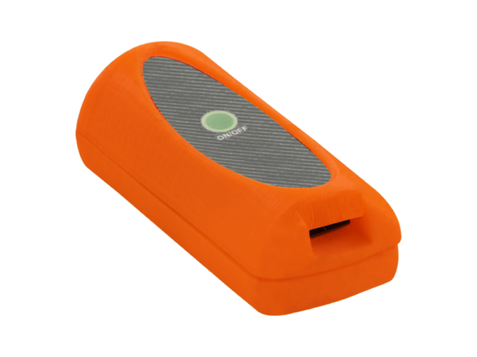

# Condor - CM-311

The CM-311 is a compact GPS tracker from Condor designed specifically for pet monitoring. Small and lightweight, it provides position updates over a cellular connection so pets can be tracked without interfering with daily activity. Its form factor and focus on comfort make it suitable for dogs and cats that need unobtrusive, continuous location visibility.

As a Plaspy compatible device, the CM-311 integrates into Plaspy's real-time tracking platform to provide route visualization, routine monitoring, and basic alerting. Pairing the tracker with Plaspy brings pet tracking into a cloud based interface where owners can view live position, review route history, and configure notifications alongside other monitored assets.

## Key Highlights

- Compatible with Plaspy for real time tracking and route playback
- Compact lightweight design aimed at minimizing discomfort for dogs and cats
- Uses cellular transmission for continuous location updates without user intervention
- Useful for visualizing daily routes and monitoring habitual movements
- Quick to deploy for immediate tracking after setup and pairing
- Supports notifications and location playback to assist in rapid recovery if a pet goes missing

## How It Works with Plaspy

When used with Plaspy the CM-311 sends periodic location updates to the platform where pet owners and caretakers can monitor live position and review past movement. Plaspy translates the incoming location data into maps, timelines, and configurable alerts to make pet monitoring straightforward and actionable.

- Live location display in Plaspy for real time monitoring
- Route history and playback to review daily movement and identify common paths
- Geofence and missing pet alerts configured in Plaspy for quick notification
- Central management of multiple devices so owners can track several pets in one place
- Status and basic telemetry reporting available through the Plaspy interface for operational oversight

## Typical Use Cases

- Everyday pet monitoring to check live location during walks and outings
- Lost pet recovery using timely location updates and alerts
- Monitoring pets during temporary care such as sitters boarding or vet visits
- Tracking off leash or urban exploration to maintain awareness of pet movement
- Observing routine activity patterns to spot changes in behavior or location habits

## Why Choose This Tracker with Plaspy

The CM-311 is a practical choice for pet owners who want a small comfortable tracker combined with the visibility and tools of a mature tracking platform. Its pet focused design reduces interference with normal movement while Plaspy provides the mapping, alerting, and device management needed to keep owners informed. That combination makes it straightforward to scale from single pet monitoring to managing multiple animals under one account.

Because the CM-311 integrates with Plaspy, owners benefit from a cloud based experience used across different monitoring scenarios without introducing unnecessary complexity. If you need a compact tracker that leverages Plaspy for live tracking, playback, and alerts, the CM-311 is a sensible option to consider.

Learn more about Plaspy on the main website https://www.plaspy.com. Product specifications availability and manufacturer details can change over time so please verify current information on the Condor website https://condorskyseeker.com/.
