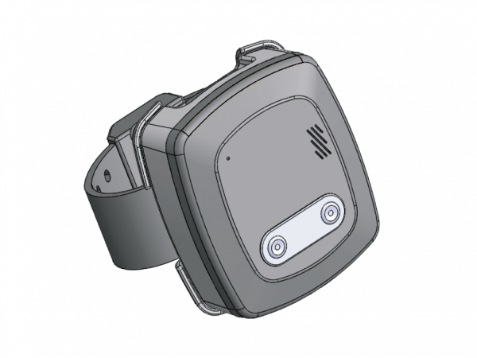

# Condor - GE-810

The GE-810 is a Plaspy compatible personal monitoring device engineered for controlled-supervision environments. Built around modern 4G LTE cellular connectivity and a rugged IP67 housing, the GE-810 provides secure two-way voice, vibration alerts and reliable tamper/removal notifications — making it a practical option for programs that require continuous oversight and timely event reporting.

Designed as a wearable shackle-style tracker for people with reduced freedom of movement, the GE-810 integrates with the Plaspy platform to surface critical telemetry, status alerts, and communications to monitoring teams. Its waterproof enclosure and simple event-driven features deliver dependable on-person monitoring in real-world conditions.

## Key Highlights

- Plaspy compatible device for streamlined monitoring and centralized reporting.
- 4G LTE cellular connectivity for reliable data and voice transmission.
- Two-way voice calling to enable direct communication between the wearer and supervisors or call centers.
- Vibration alert for discreet notification and acknowledgement workflows.
- Tamper and removal detection that generates immediate alerts when the shackle is manipulated.
- IP67-rated waterproof enclosure for durability in wet and outdoor environments.
- Wearable shackle/bracelet form factor tailored to supervised-release and secure-monitoring programs.

## How It Works with Plaspy

When connected to Plaspy, the GE-810 transmits device events and status over the cellular network so monitoring teams see timely updates in the Plaspy dashboard or mobile apps. Plaspy ingests alerts and voice event logs, enabling real-time tracking of device state and rapid incident response. Where location data \(GNSS\) is available from the device or paired systems, Plaspy can combine that information with the GE-810’s telemetry for full situational awareness.

- Real-time alerts and telemetry updates delivered to Plaspy for monitoring and audit trails.
- Two-way voice event logs and call-handling integrated into incident workflows.
- Tamper/removal alerts pushed immediately to supervisors to trigger response procedures.
- Vibration alerts used for discreet warnings, compliance prompts, or acknowledgement flows.
- Integration-friendly data output that can be correlated with GPS tracker feeds and other telemetry in Plaspy.

## Technical Overview

| Model | GE-810 |
| --- | --- |
| Connectivity | 4G LTE cellular |
| Bands | Not specified in supplied description \(varies by model/region\) |
| Power & Battery | Not specified |
| Interfaces | Two‑way voice call, vibration alert, tamper/removal alert \(wearable shackle inputs\) |
| GNSS | Not specified in supplied description \(location updates available when GNSS-capable configurations are deployed\) |
| Bluetooth | Not specified |
| Remote Management | Not specified |
| Form Factor | Wearable shackle/bracelet; IP67 waterproof enclosure |

## Use Cases

- Supervised-release and court-mandated monitoring — tamper alerts and two-way voice simplify compliance and response.
- Community corrections and secure supervision — lightweight wearable design for continuous oversight.
- Elder and vulnerable-person oversight where discreet vibration alerts and voice contact are required for welfare checks.
- Temporary custody and secure transport monitoring where durable, waterproof hardware is essential.

## Why Choose This Tracker with Plaspy

Selecting the GE-810 as part of a Plaspy deployment delivers a focused solution for personal supervision programs that need dependable cellular communications, tamper detection, and simple on-device interaction. Its IP67-rated housing reduces environmental failures, while two-way voice and vibration alerts provide direct human interaction and compliance tools that complement Plaspy’s reporting, alerting, and case-management features. Plaspy’s platform also supports broader telemetry and GPS tracker feeds, and can correlate GE-810 events with fleet management, anti-theft, or other telemetry sources — including fuel monitoring, ignition/immobilizer controls, and Bluetooth sensors on mixed-device deployments — enabling unified situational awareness across assets and people.

In short, the GE-810 offers a practical, Plaspy compatible option for programs that require robust tamper detection, secure communications, and environmental durability. Its straightforward feature set and integration readiness help agencies and service providers implement reliable monitoring workflows without unnecessary complexity.

