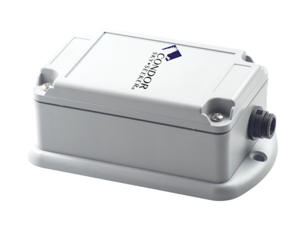

# Condor - TH-923

The TH-923 is a Plaspy compatible GPS tracker engineered for continuous monitoring of heavy machinery, maritime vessels, containers and mobile units that transport high value cargo. Designed to provide uninterrupted location and status updates in both urban and remote environments, the TH-923 combines cellular transmission with Iridium satellite failover so assets remain visible across coverage gaps. This hybrid approach makes the unit suitable for fleet management, anti theft protection and long haul logistics where persistent connectivity matters.

As a device that integrates with Plaspy, the TH-923 delivers location fixes, event telemetry and alerts into the Plaspy real time platform so fleet managers and security teams can maintain situational awareness. Automatic failover from cellular to the Iridium satellite network helps ensure that position and event data continue to flow to Plaspy when cellular coverage is unavailable, which is especially relevant for maritime operations, rural worksites and cross border transport.

## Key Highlights

- Hybrid communications that combine cellular transmission with automatic Iridium satellite fallback for continuous coverage.
- Built for remote and maritime environments where persistent connectivity is important for monitoring and security.
- Plaspy compatible for real time tracking, geofencing, alerts and consolidated reporting in a single platform.
- Optimized for high value cargo, containers and heavy equipment that require reliable traceability and anti theft monitoring.
- Continuous position updates to maintain operational visibility during long transits and in coverage gaps.
- Suitable for mixed fleet deployments including trucks, worksite machinery, vessels and portable asset installations.

## How It Works with Plaspy

The TH-923 sends location and event data into Plaspy using cellular networks under normal conditions and automatically switches to the Iridium satellite network when cellular service is lost. This hybrid connectivity model preserves tracking continuity so Plaspy can display live locations, deliver alerts and retain history even in remote or maritime settings.

- Real time location and telemetry updates appear in Plaspy for mapping, route replay and historical reports.
- Automatic cellular to Iridium failover preserves visibility when assets leave cellular coverage or operate at sea.
- Continuous position and event data support fleet dashboards, operational oversight and compliance logs.
- Geofence, motion and other event alerts are routed into Plaspy for timely notification and response.
- Plaspy can ingest optional telemetry such as ignition state, fuel related fields, immobilizer events or Bluetooth sensor data when those signals are provided by the installed tracker or vehicle wiring.

## Typical Use Cases

- Fleet anti theft monitoring for trucks and trailers operating across remote regions and long routes.
- Maritime vessel tracking where intermittent cellular coverage requires satellite backup for continuous visibility.
- Container and cargo monitoring during long transits to preserve chain of custody and location history.
- Heavy machinery and mining equipment oversight at rural worksites to support security and maintenance planning.
- High value mobile units that need reliable tracking and alerting across mixed coverage areas.

## Why Choose This Tracker with Plaspy

The TH-923 is a practical option for organizations that need resilient asset visibility through mixed network environments. Its hybrid cellular and Iridium satellite design helps keep telemetry flowing into Plaspy, reducing blind spots and supporting faster incident response, unified reporting and dependable historical records for compliance or claims review. For operators of dispersed fleets, maritime assets or remote equipment, the TH-923 paired with Plaspy offers continuity of location data and event notifications that improve operational oversight.

To learn more about how Plaspy can work with compatible devices like the Condor TH-923 visit https://www.plaspy.com. Product specifications, availability and manufacturer details can change over time so please verify current technical information and options with the manufacturer at https://condorskyseeker.com/ before purchase.
