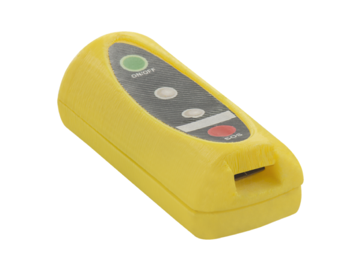

# Condor - TP-810

The Condor TP-810 is a compact personal GPS tracker designed for discreet wear and continuous location monitoring of people. Its small, lightweight form factor is suitable for users of different ages and builds, and the device is positioned to provide fast location updates together with an accessible panic workflow for emergency signaling.

As a Plaspy compatible tracker, the TP-810 integrates its core safety features with Plaspy’s monitoring platform to simplify oversight and response. Administrators, caregivers, and program managers can add the TP-810 into Plaspy to view locations, receive SOS alerts, and include incidents in their operational workflows without complex device management.

## Key Highlights

- Plaspy compatible personal GPS tracker for straightforward platform integration
- Compact, lightweight design intended for comfortable and discreet wear
- Dedicated panic button for immediate SOS signaling to assigned contacts or monitoring teams
- Built in emergency telephone call capability to reach caregivers or emergency contacts
- Focused on person safety monitoring rather than vehicle telemetry or fleet functions
- Well suited to managed deployments such as care programs and small scale monitoring initiatives

## How It Works with Plaspy

When used with Plaspy, the TP-810 delivers location and event information into the Plaspy dashboard so teams can monitor individuals and manage responses from a single interface. Plaspy compatibility enables consistent visibility and standardized notification handling for the device events.

- Real time location updates displayed on the Plaspy map for active monitoring
- Panic button events forwarded into Plaspy and routed according to configured notification rules
- Emergency call events can be logged in Plaspy as part of incident records and histories
- Supports safe zone monitoring with Plaspy geofencing and automatic alerts when boundaries are crossed
- Useful for centralized monitoring where prompt notification and recorded incident context are important

## Typical Use Cases

- Senior care and dementia safety programs that need continuous location awareness and quick SOS handling
- Child safety and parental monitoring where small wearable devices provide reassurance during activities
- Lone worker protection in roles that require discreet personal safety devices and alerting
- Special needs support where caregivers need reliable location and emergency communication options
- Short term event or volunteer supervision where temporary personal tracking improves response capability

## Why Choose This Tracker with Plaspy

The TP-810 is a purpose built personal safety tracker that emphasizes ease of wear and a clear emergency pathway. For organizations and families using Plaspy, it provides a focused option to add human safety monitoring to an existing Plaspy deployment without introducing vehicle focused features or complex telemetry management.

Choosing the TP-810 with Plaspy makes sense when the priority is reliable personal location visibility and a simple SOS workflow that integrates into Plaspy’s notifications and incident tracking. If your program later requires vehicle telemetry or other specialized device capabilities, Plaspy supports a wider range of compatible devices, while the TP-810 remains a compact solution dedicated to person centered safety.

To learn more about how Plaspy can support TP-810 deployments and other compatible devices, visit https://www.plaspy.com. Product specifications, availability, and manufacturer details can change over time, so please verify current technical details and documentation with the manufacturer at https://condorskyseeker.com/ before procurement or large scale deployment.
