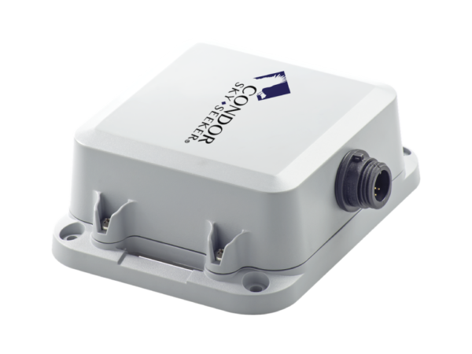

# Condor - TS-728

The TS-728 is a purpose-built maritime tracker designed for reliable vessel monitoring via the Iridium satellite network. As a Plaspy compatible GPS tracker, the TS-728 brings global, no-limit coverage to fleet managers and vessel owners who need real-time tracking and telemetry across oceans and remote sea lanes.

Whether you operate a single yacht, a commercial fishing fleet, or multiple workboats, the TS-728 combined with Plaspy delivers centralized fleet management, anti-theft monitoring, and remote status visibility from anywhere in the world using satellite connectivity.

## Key Highlights

- Global satellite connectivity via Iridium — continuous coverage for vessels beyond cellular range.
- Plaspy compatible for seamless real-time tracking, reporting, and alerting across an integrated platform.
- Suitable for all types of maritime vessels — from leisure craft to commercial fleets.
- Enables telemetry collection at sea to support fleet management and operational decision-making.
- Supports anti-theft workflows and remote incident alerts when integrated with on-board sensors or systems.
- Scalable deployment for single vessels or large fleets with centralized Plaspy dashboards and reports.
- Designed for continuous monitoring in remote environments where terrestrial networks are not available.

## How It Works with Plaspy

The TS-728 uses the Iridium satellite network to send location and telemetry from any point on the globe to Plaspy. Once data reaches Plaspy, it is available in real time through maps, alerts, and reports so operators can monitor vessel position, detect events, and act quickly. Integration with Plaspy allows administrators to consolidate satellite-tracked vessels into the same workflows used for cellular GPS trackers.

- Real-time location and telemetry updates delivered via satellite to Plaspy for continuous situational awareness.
- Event and alarm forwarding: Plaspy can trigger notifications for geofence breaches, unauthorized movement, or onboard alarms when events are emitted by the tracker.
- Engine and fuel telemetry: Where the TS-728 installation includes engine or sensor inputs, Plaspy can record and report fuel monitoring and engine status for operational insight.
- Remote control and immobilization: If enabled in the installed configuration, Plaspy can forward authorized remote commands \(such as immobilizer or shutdown requests\) via the satellite link.
- Sensor data and BLE: When paired with compatible sensors, Plaspy can ingest Bluetooth sensor data forwarded by the TS-728 to extend monitoring to temperature, cargo conditions, or movement.

## Technical Overview

| Model | TS-728 |
| --- | --- |
| Connectivity | Iridium satellite network \(global satellite connectivity as specified by the device description\) |
| Bands | Satellite network connectivity \(Iridium\) — global coverage; specific RF bands not specified in the supplied description |
| Power & Battery | Not specified in the supplied description; confirm backup battery and power-loss behavior with vendor |
| Interfaces | Not specified; vessel installations commonly support wired sensor inputs and CAN/serial integrations depending on configuration |
| GNSS | Positioning capability is implied for vessel tracking; confirm GNSS type and accuracy with the manufacturer |
| Bluetooth | Not specified; Bluetooth sensor support may be available in certain configurations—confirm if BLE sensors are required |
| Remote Management | Not specified; check vendor options for remote configuration, firmware updates, and device diagnostics |
| Form Factor | Marine-grade installation suitable for monitoring vessels of various sizes; specific dimensions and enclosure ratings not provided |

## Use Cases

- Fleet anti-theft and immobilization: Monitor vessel movement outside authorized zones and coordinate recovery or immobilizer actions through Plaspy when supported by your installation.
- Long-range fleet management: Track fishing fleets, cargo boats, and offshore service vessels across vast sea areas where cellular coverage is unavailable.
- Remote telemetry for engines and fuel: Collect engine status and fuel-related telemetry from vessels to optimize routes, maintenance, and operating costs \(where sensors are installed\).
- Cold chain and cargo monitoring: When combined with compatible sensors forwarded by the tracker, monitor temperature or cargo conditions for refrigerated holds and sensitive freight.
- Safety and compliance reporting: Maintain voyage logs and position histories in Plaspy for operational accountability and regulatory reporting across international waters.

## Why Choose This Tracker with Plaspy

For maritime operators who require reliable global position and telemetry, the TS-728 paired with Plaspy offers a straightforward path to 24/7 vessel oversight beyond coastal cellular limits. The Iridium satellite link ensures coverage across oceans, while Plaspy delivers unified fleet management tools — real-time tracking, alerts, and consolidated reporting — so shore teams can manage assets and respond quickly to incidents.

Choosing a Plaspy compatible satellite tracker like the TS-728 emphasizes operational continuity, safety, and visibility. It is particularly valuable for organizations that need scalable fleet operations, anti-theft measures, and the ability to include telemetry such as fuel monitoring or engine status when on-board interfaces and sensors are installed. For exact interface options, battery configuration, or sensor support, consult the supplier to match the TS-728 installation to your operational requirements.

