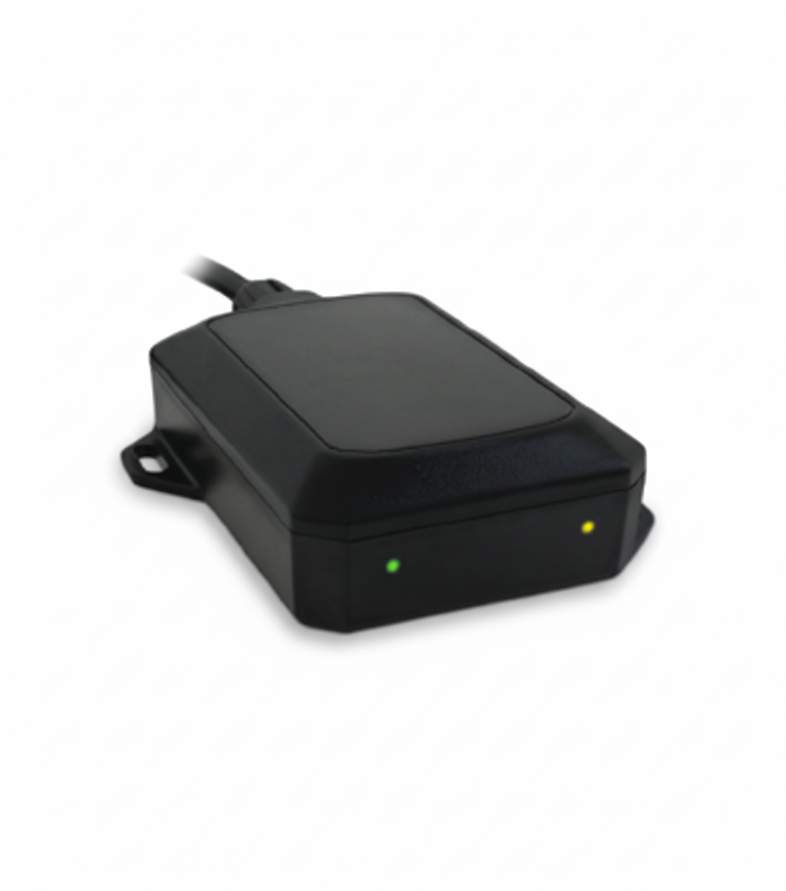

# DCT - Syrus 3G+

The Syrus 3G+ is a durable, API ready GPS tracker and telematics hub designed for reliable deployment across fleet and IoT projects. Built to accept multiple sensors and accessories, it provides expanded I O capacity and intelligent counters to deliver telemetry useful for real time tracking, route monitoring, engine diagnostics, and event driven automation. The device is enclosed to IP65 standards and optimized for long term battery backed use with an ultra low power sleep mode.

As a Plaspy compatible device, the Syrus 3G+ is well suited for fast integration into cloud based fleet management workflows. Its Pegasus Gateway and REST API readiness, together with the Syrus IoT development kit and enablement platform, simplify data ingestion and mapping into Plaspy so teams can visualize location, configure alerts, and build automation without reinventing backend connectivity. This makes the model a practical option for operators who want robust field hardware paired with a mature telematics platform.

## Key Highlights

- API ready for fast integration with cloud platforms and Plaspy using Pegasus Gateway and REST APIs
- Multi sensor and accessory support to collect richer telemetry beyond basic location
- Rugged IP65 enclosure for reliable outdoor and vehicle use
- Ultra low power sleep mode suitable for battery backed and long term deployments
- Built in counters and event logic to support route monitoring and automation
- Developer focused tools including Syrus IoT kit and diagnostics enablement for faster integration

## How It Works with Plaspy

When connected, the Syrus 3G+ streams vehicle and sensor data into Plaspy through its API gateway, enabling near real time visibility and historical analysis. Plaspy ingests location and telemetry and exposes that information across live maps, alerts, and reports so operations teams can monitor fleets and respond to events.

- Real time location updates and historical replay visible in Plaspy maps and timelines
- Telemetry and event reporting for route monitoring, counters, and diagnostics shown in dashboards
- Sensor values and accessory states displayed for operational oversight and trend analysis
- Alerting and automation triggers in Plaspy based on Syrus event logic and counters
- Developer workflows supported by Pegasus Gateway and REST APIs for custom parsing and webhooks

## Typical Use Cases

- Fleet management with live GPS tracking, route compliance, and operational reporting
- Anti theft workflows and security monitoring with event triggered alerts and remote actions
- Engine diagnostics and maintenance planning using streamed counters and telemetry
- IoT and M2M integrations leveraging the Syrus IoT kit for custom sensors and automations
- Remote asset monitoring and long term deployments where low power consumption is required

## Why Choose This Tracker with Plaspy

The Syrus 3G+ combines rugged hardware and developer friendly connectivity, which helps reduce integration effort when deploying with Plaspy. Its focus on multi sensor inputs, telemetry counters, and an enablement platform makes it practical for teams that need more than simple location data and want to build automation, diagnostics, or security workflows into their fleet operations.

If you want to learn more about using Plaspy with compatible trackers, visit https://www.plaspy.com for platform information and service options. Product specifications, availability, and manufacturer details can change over time, so please verify current technical and variant information on the official manufacturer site https://www.digitalcomtech.com/.
