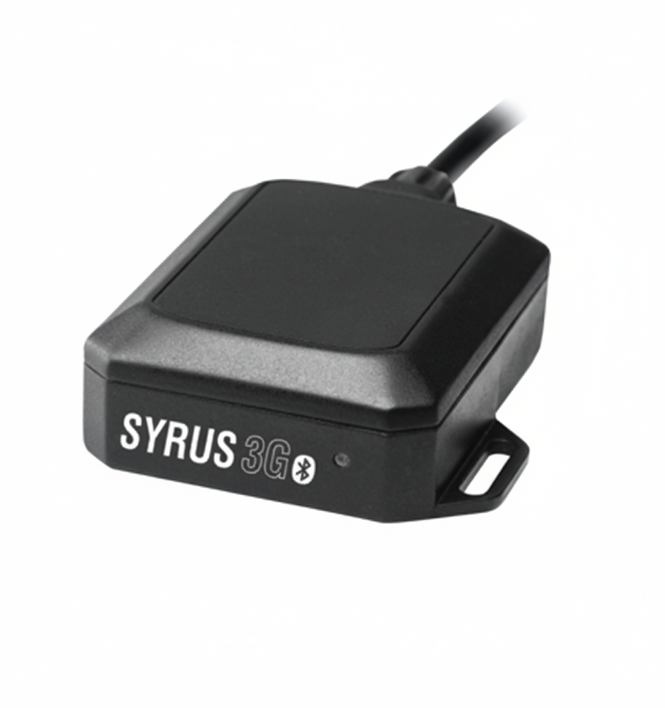

# DCT - Syrus 3G+ BT

The Syrus 3G+ BT is a rugged telematics gateway from DCT designed for extensible IoT and M2M deployments. Intended for fleet management and industrial monitoring, the device supports Bluetooth 4.1 Smart Ready for low power sensor pairing, multiple physical accessory ports for telemetry and peripherals, and an optional Iridium Satcom accessory for satellite backup. As a hardware gateway, it consolidates location and sensor data at the edge for reliable tracking and operational visibility.

This model is compatible with Plaspy and can integrate into cloud tracking workflows through Pegasus Gateway REST APIs. That integration makes the Syrus 3G+ BT a practical choice when you need a hardened edge device that forwards location, status, and sensor streams into Plaspy for real time monitoring, alerts, and reporting. Its modular approach and accessory support provide flexibility for varied fleet and industrial telemetry requirements.

## Key Highlights

- Plaspy compatible gateway that integrates via Pegasus Gateway REST APIs for cloud data exchange
- Bluetooth 4.1 Smart Ready support for pairing low power sensors and tags such as the Syrus BTT-1634
- Rugged design suited for vehicle telematics and industrial environments with multiple accessory ports
- Optional Iridium satellite backup accessory to maintain connectivity in areas without cellular service
- Modular sensor and accessory ecosystem enabling expanded telemetry collection across use cases
- Cloud ready integration that helps streamline device data into Plaspy monitoring and reporting

## How It Works with Plaspy

The Syrus 3G+ BT forwards telemetry and location data to Plaspy through standardized gateway APIs, allowing Plaspy to consume device streams and present them in maps, dashboards, and alerting rules. Plaspy turns those incoming data feeds into actionable insights for fleet operations, security alerts, and maintenance workflows.

- Real time location and telemetry updates appear in Plaspy for map based monitoring and history review
- Bluetooth sensor data from paired tags can be relayed into Plaspy for temperature, motion, door, or custom sensor monitoring
- Optional satellite accessory provides continuity for critical alerts and location updates when cellular coverage is unavailable
- Multiple accessory ports let the device aggregate inputs such as fuel or status sensors for consolidated reporting in Plaspy
- Pegasus Gateway REST APIs enable remote configuration and management workflows to streamline deployments with Plaspy

## Typical Use Cases

- Fleet management for vehicles needing robust tracking, route history, and operational oversight
- Anti theft and security monitoring combining sensor inputs with Plaspy alerts and optional satellite fallback
- Remote industrial asset monitoring using Bluetooth tags for environmental or tamper detection
- Fuel and status telemetry for dashboards that track consumption and unauthorized use
- Hybrid connectivity setups where cellular is primary and satellite provides a resilient fallback path

## Why Choose This Tracker with Plaspy

The Syrus 3G+ BT offers a practical balance of field hardened hardware and cloud ready integration for organizations that require flexible telemetry at the edge. Its Bluetooth support and multi port accessory options let teams collect a broader set of sensor data while Pegasus Gateway REST APIs reduce integration complexity when feeding those streams into Plaspy. For fleet and industrial users, that combination supports faster deployments, consistent real time visibility, and improved operational oversight.

To learn more about Plaspy and how it can work with compatible devices like the Syrus 3G+ BT visit https://www.plaspy.com. Product specifications, availability, and manufacturer details can change over time; please verify current technical information and accessory options on the manufacturer website https://www.digitalcomtech.com/ before making procurement or deployment decisions.
