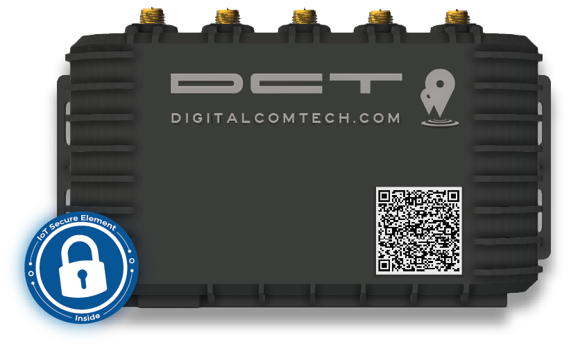

# DCT - Syrus 4G

The Syrus 4G Telematics Gateway from DCT is a rugged, enterprise-grade GPS tracker designed for intensive fleet management and industrial IoT deployments. As a Plaspy compatible device, Syrus 4G brings multi-constellation GNSS, dual cellular modems and extensive vehicle interfaces to enable reliable real-time tracking, telemetry collection and edge processing — all built for harsh vehicle environments and large-scale fleets.

Engineered for integrators and fleet operators who require secure, high-availability connectivity, Syrus 4G supports local data preprocessing, developer SDKs and cloud-forwarding to platforms like Plaspy. With builtin Bluetooth sensors support, CAN bus telemetry and optional satellite backup, this gateway enables anti-theft workflows, remote diagnostics, fuel and engine telemetry collection, and fast integration into Plaspy for consolidated fleet visibility.

## Key Highlights

- Enterprise-grade GPS tracker with multi-constellation GNSS \(GPS/GLONASS\) for accurate real-time tracking across regions.
- Dual 2G/3G/4G MIMO cellular modems plus optional Iridium satellite accessory and eSIM/backup e-SIM for resilient global coverage.
- Rich vehicle I/O: dual CAN \(J1939/J1708\), RS232/RS485, 10/100 Ethernet and multiple Molex connectors for deep telemetry and sensor integration.
- Edge compute platform \(TI ARM Cortex-A8, 512MB RAM, 4GB eMMC, expandable microSD up to 512GB\) for local preprocessing, reducing cloud bandwidth.
- Bluetooth BLE 4.2 for integration with Bluetooth sensors, driver devices and two-way audio notifications.
- Secure element and tamper-resistant design for cryptographic authentication — suitable for anti-theft and trusted telemetry.
- Remote management and OTA via Syrus Cloud with SDKs and APIs for rapid application development and Plaspy integration.

## How It Works with Plaspy

Integrating Syrus 4G with Plaspy delivers a robust pipeline for real-time tracking, telemetry visualization and event alerting. The gateway collects GNSS position fixes, vehicle bus data and sensor inputs at the edge, preprocesses or aggregates those payloads, and forwards structured telemetry to Plaspy using API/forwarder protocols. This reduces latency and preserves network bandwidth while enabling live fleet dashboards, historical route playback and rich telemetry reporting in Plaspy.

- Real-time location and telemetry updates: GNSS fixes and processed location are pushed to Plaspy for live tracking.
- Vehicle bus data via dual CAN \(J1939/J1708\): engine diagnostics, RPM, fuel-related signals and status codes can be mapped into Plaspy telemetry.
- Engine error codes & maintenance events: Syrus 4G detects and forwards diagnostic trouble codes for alerting and preventive maintenance workflows in Plaspy.
- Bluetooth sensors & driver devices: BLE 4.2 connectivity enables temperature, asset sensors or driver devices to feed into Plaspy through the gateway.
- Remote diagnostics and OTA: Syrus Cloud and onboard tooling allow remote configuration and software updates that keep Plaspy integrations current and secure.

## Technical Overview

| Connectivity | Dual cellular modems \(2G/3G/4G MIMO\), dual-band Wi‑Fi \(2.4/5.8 GHz\) MIMO, Bluetooth BLE 4.2, optional Iridium Satcom accessory, eSIM and backup e-SIM support |
| --- | --- |
| Bands | Supports 2G/3G/4G cellular generations; specific RF bands depend on module/variant and regional model selection |
| Power & Battery | Rugged vehicle/industrial gateway form factor; designed for vehicle-installed power systems. \(No internal backup battery specified in the product description.\) |
| Interfaces | Dual CAN \(J1939 / J1708\), RS232, RS485, 10/100 Ethernet \(DHCP\), multiple Molex connectors, micro USB, status LEDs and microcontroller for peripheral control |
| GNSS | Multi-constellation GNSS: GPS and GLONASS for reliable positioning and real-time tracking |
| Bluetooth | BLE 4.2 \(SBC + A2DP\) for sensors, two-way audio and driver notifications |
| Remote Management | Syrus Cloud remote device management, digital twin visualization, OTA interactions, remote configuration, diagnostics and SDK/API access |
| Form Factor | Rugged enterprise-grade telematics gateway for vehicle and industrial deployments; local storage via 4GB eMMC + microSD up to 512GB |

## Use Cases

- Fleet management and route monitoring — real-time GPS tracker data and CAN-derived telemetry streamed into Plaspy dashboards for operational visibility.
- Anti-theft monitoring and tamper detection — secure element and tamper-resistant hardware combined with live tracking to detect unauthorized movement.
- Remote diagnostics and maintenance — forward engine error codes and maintenance events to Plaspy for automated alerts and workshop scheduling.
- Fuel and engine telemetry analytics — collect fuel-related signals and engine parameters from vehicle CAN and feed into Plaspy for fuel monitoring and efficiency programs.
- Sensorized assets and driver behavior — BLE sensors and a 3-axis accelerometer enable event-driven alerts, harsh-braking detection and environment sensing for compliance and safety.

## Why Choose This Tracker with Plaspy

Syrus 4G is a comprehensive telematics gateway for operators who need more than a simple GPS tracker. Its edge compute capabilities, dual cellular redundancy, optional satellite backup and rich vehicle interfaces make it ideal for scalable fleet deployments and mission-critical telemetry. When integrated with Plaspy, Syrus 4G provides reliable real-time tracking, deep telemetry for predictive maintenance, and secure communications backed by a tamper-resistant secure element. For fleets seeking a Plaspy compatible gateway that supports developer toolchains, remote management and advanced sensor integration, Syrus 4G delivers the performance and flexibility required for modern fleet management and industrial monitoring.

