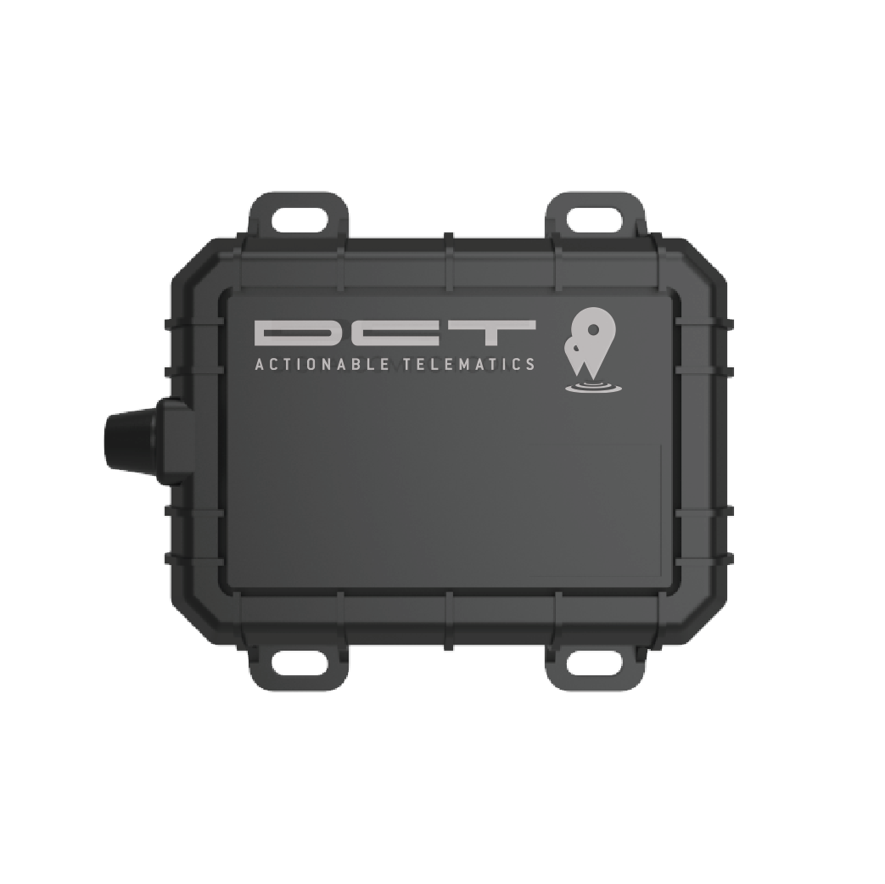

# DCT - Syrus 4G Lite

The Syrus 4G Lite is a rugged IoT telematics gateway designed for continuous, real time tracking and remote diagnostics in fleet and industrial telemetry projects. It combines integrated cellular and GNSS antennas, an IP65 water resistant enclosure, and an internal backup battery to maintain location reporting and event capture for vehicles, trailers, and field assets operating in demanding environments.

As a device compatible with Plaspy, the Syrus 4G Lite is suited to centralized fleet management and operational monitoring workflows. Built on an embedded Apex Linux platform and programmable with Syruslang, the gateway supports edge intelligence, blackbox incident capture, and broad cellular connectivity, making integration with Plaspy straightforward for teams that need reliable location, engine fault telemetry, and remote device management.

## Key Highlights

- Plaspy compatible GPS tracker for real time tracking and centralized fleet management
- Multi mode cellular connectivity for broad coverage and telemetry efficiency
- Onboard GNSS and blackbox recording for location accuracy and incident logs
- Engine diagnostics and fault code reporting to support proactive maintenance
- Rugged IP65 enclosure and integrated antennas for outdoor and vehicle use
- Internal backup battery to preserve connectivity during power interruptions
- Edge programmability with Syruslang and Apex OS for local logic and filtering

## How It Works with Plaspy

The Syrus 4G Lite streams GNSS position, device health, blackbox events, and diagnostic telemetry to Plaspy to power live maps, alerts, and historical reporting. Plaspy ingests those feeds to provide operational visibility, correlate events, and automate maintenance and security workflows.

- Real time location and telemetry updates for live dashboards and route replay
- Engine fault codes and vehicle health data to accelerate diagnostics and service scheduling
- Blackbox event logs for forensic analysis and incident review
- Remote configuration and over the air firmware updates coordinated from Plaspy device management
- Correlation of ignition, door, alarm, and fuel related signals with location and timestamps when peripheral inputs are available

## Typical Use Cases

- Fleet anti theft monitoring and coordinated immobilization workflows
- Vehicle health and maintenance planning using reported fault codes
- Trailer and equipment tracking in harsh outdoor environments
- Incident analysis and insurance documentation using time stamped blackbox logs
- Industrial IoT telemetry aggregation for logistics and asset utilization

## Why Choose This Tracker with Plaspy

The Syrus 4G Lite pairs resilient hardware with flexible connectivity and embedded software to deliver dependable telemetry into Plaspy. Its combination of reliable GNSS, blackbox capture, engine diagnostics, and edge programmability helps ensure Plaspy receives actionable data for real time monitoring, alerts, and reporting without excessive gateway customization.

For teams managing fleets or remote assets who need scalable, reliable tracking and remote device management, the Syrus 4G Lite complements Plaspy’s operational and maintenance workflows. Learn more about Plaspy on the main website https://www.plaspy.com. Product specifications, availability, and manufacturer details can change over time, so please verify current specifications and documentation on the manufacturer site https://www.digitalcomtech.com/.
