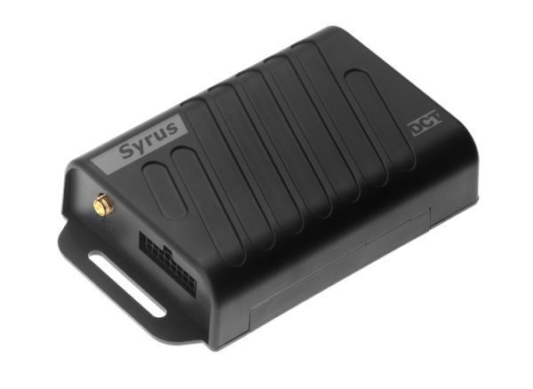

# DCT - Syrus GPS

The DCT Syrus GPS is a high performance GPS tracker built for IoT and M2M applications that need fast and reliable data transfer. It combines location tracking with a fully integrated 3 axis internal digital accelerometer that supports instant acceleration monitoring and conditional crash history reporting. The device also includes features such as tamper detection, a large store and forward buffer capable of holding many events, configurable geofencing, and a water resistant IP65 enclosure to withstand challenging environments.

As a model compatible with Plaspy, the Syrus GPS can feed Plaspy with location and event data to support fleet visibility, monitoring, and operational reporting. Its satellite communication compatibility via IRIDIUM when paired with an optional SATCOM accessory provides an additional connectivity path for remote assets. Combined with the PEGASUS Gateway option for OTA configuration management, this tracker is a practical choice for organizations that need resilient tracking and configurable event reporting inside the Plaspy platform.

## Key Highlights

- High speed data transfer designed for reliable communications in IoT and M2M deployments
- Integrated 3 axis digital accelerometer with crash condition history and motion detection
- Optional IRIDIUM satellite backup capability with separate SATCOM accessory for remote coverage
- Large store and forward buffer to preserve event data when networks are unavailable
- Configurable geofencing with support for many user defined circular and polygonal areas
- Water resistant IP65 rating and tamper detection for rugged field use
- PEGASUS Gateway support for remote configuration and OTA management

## How It Works with Plaspy

When connected to Plaspy, the DCT Syrus GPS streams position and event information into the Plaspy fleet management environment so operators can monitor assets, respond to incidents, and analyze historical activity. Plaspy uses the tracker data to deliver visibility, alerts, and reporting that support day to day fleet operations and exception handling.

- Real time and near real time location visibility for vehicles and mobile assets in the Plaspy dashboard
- Event and alert generation for crash detection, motion, tamper, and geofence breaches
- Satellite fallback monitoring for assets operating in remote areas when cellular is not available
- Use of the tracker store and forward buffer to maintain data continuity after connectivity gaps
- Geofence based operational alerts and reporting for route compliance and area monitoring
- Centralized device configuration and management workflows supported via PEGASUS Gateway integration

## Typical Use Cases

- Fleet vehicle tracking where driver safety and incident reporting are important
- Monitoring of heavy equipment and mobile assets in harsh or remote environments
- Logistics and long haul operations that benefit from satellite fallback for coverage gaps
- Asset security use cases such as tow alerts and tamper detection for parked equipment
- Operational programs that require geofence enforcement and historical event analysis

## Why Choose This Tracker with Plaspy

The Syrus GPS offers a balanced feature set for organizations that need dependable tracking, event reporting, and rugged hardware. Its integrated accelerometer and crash history capability make it especially relevant for fleets focused on safety and driver behavior analytics, while the store and forward buffer helps ensure continuity of records during temporary connectivity loss. Satellite compatibility adds resilience for remote operations where continuous cellular coverage cannot be guaranteed.

As a Plaspy compatible device, the Syrus GPS can be incorporated into Plaspy workflows for monitoring, alerting, and reporting without forcing users to compromise on device features. For more details about Plaspy and how this tracker can be used with the platform visit https://www.plaspy.com. Product specifications, availability, and manufacturer details can change over time, so please verify current specifications and accessory requirements on the manufacturer site https://www.digitalcomtech.com/.
