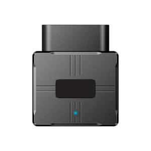

# DCT - SYRUS OBDII-CAT1

The SYRUS OBDII-CAT1 is a plug-and-play OBDII telematics dongle from DCT Syrus designed for passenger and light-duty vehicles. Built to deliver real-time location and vehicle diagnostics directly from the vehicle port, the device is intended to enable rapid deployments and immediate data collection for fleet managers. It combines high-sensitivity GNSS positioning with vehicle telemetry and motion sensing to support common fleet visibility needs.

As a Plaspy compatible device, the SYRUS OBDII-CAT1 integrates with Plaspy for centralized visualization, alerts, and API-driven workflows. Its cloud ready and self configuring design means fleets can onboard devices quickly and begin using Plaspy for live tracking, event alerts, historical reporting, and operational oversight without complex setup work.

## Key Highlights

- Instant plug and play OBDII installation for fast fleet rollouts and minimal install time.
- High sensitivity GNSS positioning with SBAS support and performance reported up to 2 meters for accurate location data.
- Pentaband cellular connectivity for broad regional coverage and reliable telemetry delivery.
- Rich vehicle diagnostics exposed via the OBDII interface for engine and fuel related monitoring.
- Integrated 3 axis accelerometer for detection of harsh braking, impacts and driving events.
- Cloud ready device management and self configuring behaviour to simplify large scale deployments.
- Optimized form factor for passenger cars and light commercial vehicles enabling fleet scale use.

## How It Works with Plaspy

When deployed as a Plaspy compatible device, the SYRUS OBDII-CAT1 streams location, vehicle telemetry, and motion events to Plaspy where that data is ingested for real time monitoring, alerts, and reporting. Plaspy consolidates the incoming feed so fleet operators can use a single platform for visibility and operational workflows.

- Real time location updates and route monitoring to maintain continuous fleet visibility.
- Vehicle diagnostics in Plaspy dashboards for fuel monitoring, engine status trends and health checks.
- Driving event detection and impact alerts to support driver coaching and safety programs.
- Trip logs and route playback with historical reporting to analyze utilization and performance.
- Remote provisioning and device diagnostics via cloud device management to streamline support and maintenance.

## Typical Use Cases

- Live fleet tracking for passenger vehicles and light commercial fleets to improve routing and utilization.
- Remote engine diagnostics and preventive maintenance planning using OBDII telemetry to reduce downtime.
- Driver behavior monitoring programs that leverage accelerometer events for coaching and safety improvements.
- Rapid, low cost deployments where plug and play installation accelerates rollout across many vehicles.
- Anti theft awareness and alerting combined with centralized monitoring for faster response.

## Why Choose This Tracker with Plaspy

The SYRUS OBDII-CAT1 is a practical option for organizations that want accurate tracking and meaningful vehicle telemetry without complex hardware installation. Its combination of precise GNSS positioning, OBDII based diagnostics, and motion sensing makes it suitable for operators focused on operational visibility, maintenance planning, and driver safety programs. When paired with Plaspy, the device's telemetry becomes part of a centralized monitoring and reporting environment that supports alerts, fleet analytics, and integrations into broader workflows.

If you want to learn more about how Plaspy can use SYRUS OBDII-CAT1 data for fleet monitoring and operational insights, please visit https://www.plaspy.com. Product specifications and availability can change over time, so verify the latest device details and manufacturer documentation at https://www.digitalcomtech.com/.
