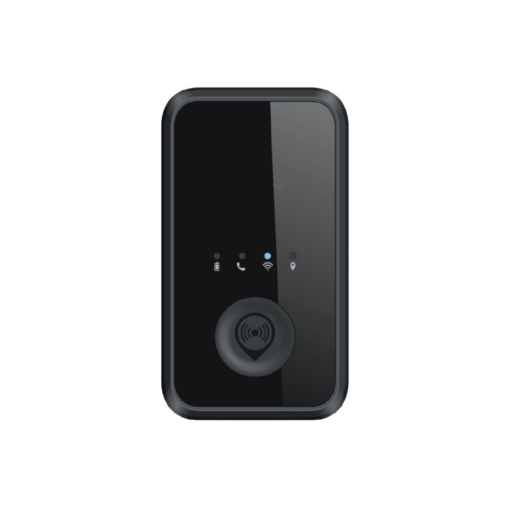

# DCT - Titan Tracker

The Titan Tracker is a portable GPS tracker engineered for personal safety and asset monitoring and is fully Plaspy compatible for seamless integration into existing monitoring and fleet workflows. Available in two SKUs \(3G ST-1734G and 4G ST-4GM1\), the Titan combines an SOS/panic button, 3-axis accelerometer for motion and impact detection, vibration feedback for confirmation of panic activations, and superior GPS performance — all in an IPX6 waterproof housing optimized for harsh field conditions.

Designed for real-time tracking and dependable remote management, Titan complements Plaspy’s dashboards and alerts to support fleet management, lone-worker protection, and portable asset tracking. The 4G variant extends coverage with LTE Cat M1 and NB‑IoT \(FDD bands 1, 3, 8, 20, 28\) and falls back to GPRS/EDGE \(900/1800\) where required. Built-in global wireless connectivity and cloud-based device management \(Pegasus Gateway IoT Platform\) simplify deployment, maintenance, and over-the-air configuration when used with Plaspy.

## Key Highlights

- Plaspy compatible: feeds real-time location and alert data into Plaspy for unified monitoring and reporting.
- Dual SKUs: choose 3G \(ST-1734G\) or 4G \(ST-4GM1\) to match regional cellular availability and coverage needs.
- SOS/panic button with vibration feedback for clear confirmation of distress activations in field scenarios.
- 3-axis accelerometer for motion detection, impact sensing and automated event generation to improve worker safety and incident response.
- 4G LTE Cat M1 / NB‑IoT support \(ST-4GM1\) with fallback to GPRS/EDGE for broad coverage and improved receiving sensitivity.
- Assisted Wi‑Fi tracking complements GNSS to improve location accuracy in dense urban or obstructed environments.
- IPX6 waterproof casing and rugged design suitable for wet and harsh environments.
- Ultra-low-power sleep mode to extend battery life for portable, long-duration deployments.

## How It Works with Plaspy

When integrated with Plaspy, the Titan Tracker streams essential position, status and event data into Plaspy’s platform for real-time tracking, alerting and historical reporting. Plaspy ingests location updates, SOS/panic alerts, motion and impact events triggered by the accelerometer, and device connectivity/health information, enabling dispatch, automated alerts, geofencing and analytics workflows.

- Real-time location and telemetry updates delivered to Plaspy dashboards for live monitoring and route playback.
- SOS/panic alerts with vibration confirmation integrated into Plaspy notifications and escalation policies.
- Motion, impact and tamper-like events from the 3-axis accelerometer to trigger immediate alerts and logging.
- Device health and connectivity status \(cellular fallback, sleep mode activity\) for maintenance and uptime monitoring.
- Assisted Wi‑Fi tracking to improve position reliability in areas of poor GNSS reception.

## Technical Overview

| Model / SKU | ST-1734G \(3G\), ST-4GM1 \(4G\) |
| --- | --- |
| Connectivity | 3G \(ST-1734G\); 4G LTE Cat M1 and NB‑IoT \(ST-4GM1\); fallback to GPRS/EDGE 900/1800 |
| Bands | ST-4GM1: FDD bands 1, 3, 8, 20, 28; GPRS/EDGE 900/1800 fallback |
| Power & Battery | Portable design with ultra-low-power sleep mode to extend battery life \(capacity not specified\) |
| Interfaces & Inputs | SOS/panic button, 3-axis accelerometer for motion/impact sensing, vibration feedback for user confirmation |
| GNSS & Positioning | Superior GPS performance with assisted Wi‑Fi tracking to enhance location accuracy in weak-signal environments |
| Bluetooth | Not specified |
| Remote Management | Cloud-based device management via Pegasus Gateway IoT Platform; over-the-air management and configuration; technical datasheets and installation guides provided |
| Form Factor & Environmental | Portable, compact tracker with IPX6 waterproof casing for harsh and wet environments |

## Use Cases

- Fleet worker safety: provide real-time location, SOS alerts and motion events for mobile staff and field teams.
- Lone worker protection: discrete panic button with vibration feedback for immediate alerting through Plaspy.
- Portable asset tracking: track short-term rentals, toolboxes, equipment and courier parcels that require rugged, weatherproof devices.
- Logistics and last-mile delivery: monitor courier locations, incident events and connectivity status during dense urban routes.
- Temporary deployments: low-power modes and cloud-based management make the Titan suitable for project-based or seasonal tracking.

## Why Choose This Tracker with Plaspy

The Titan Tracker paired with Plaspy delivers a reliable, rugged solution for organizations that need accurate GPS tracker performance, quick alerting and simple remote management. Its dual-SKU approach lets you match cellular technology to your region — 3G where legacy networks remain, and LTE Cat M1 / NB‑IoT for modern low-power wide-area coverage — while GPRS/EDGE fallback helps maintain connectivity where LTE or NB‑IoT is limited. Assisted Wi‑Fi tracking and a sensitive GNSS receiver improve real-time tracking in challenging conditions, and the 3-axis accelerometer plus SOS button provide critical safety and event telemetry for immediate response.

For fleet management, anti-theft workflows, telemetry and operational oversight through Plaspy, the Titan provides an easy-to-deploy, remotely manageable device that reduces field visits thanks to cloud-based configuration and OTA updates through the Pegasus Gateway integration. If you need a compact, weatherproof GPS tracker for worker safety, portable asset monitoring, or logistics tasks, the Titan’s combination of connectivity options, event sensing and Plaspy compatibility delivers an efficient, scalable tracking solution.

