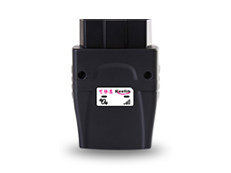

# EElink - GOT10

The GOT10 from Shenzhen EELINK Communication Technology Co. Ltd is an OBD Diagnose Tracker designed for professional fleet operators and private vehicle owners who need reliable GPS tracking combined with in-vehicle diagnostics. As a plug-and-play device that connects to the vehicle OBD port, the GOT10 captures CAN BUS and OBD diagnostic data so users can monitor location and vehicle health without additional wiring.

Because the GOT10 is compatible with Plaspy, telemetry and diagnostic streams from the device can be surfaced inside the Plaspy platform alongside other fleet data. This allows fleet managers and vehicle owners to view location, engine status, and diagnostic codes together with route history, alerts, and reports for better maintenance planning and faster incident response.

## Key Highlights

- Combined GPS tracking and in-vehicle diagnostics in a single OBD plug-in device.
- Streams CAN BUS and OBD diagnostic data to provide engine status and fault codes where available.
- Plug-and-play installation that reduces setup time for most vehicles.
- Practical for fleet use with features that help lower maintenance costs through remote diagnostics.
- Enables location tracking and telemetry reporting when vehicle systems provide GPS or CAN based location.
- Compact form factor designed for professional and private vehicle environments.

## How It Works with Plaspy

When integrated with Plaspy, the GOT10 forwards standardized telemetry and diagnostic messages so the platform can present a unified view of position and vehicle health. Plaspy users can combine location history with diagnostic insights to improve dispatching, maintenance, and security workflows.

- Real-time location and telemetry updates streamed into Plaspy for live tracking and history playback.
- Diagnostic trouble codes and CAN sourced parameters displayed in Plaspy for quick fault identification.
- Vehicle operational metrics such as speed and RPM shown in reports when those signals are available from the vehicle.
- Alerts and notifications in Plaspy based on diagnostic events or configurable telemetry thresholds.
- Consolidated reporting to support maintenance planning and operational oversight across mixed fleets.

## Typical Use Cases

- Fleet monitoring where location and engine diagnostics are needed in a single device.
- Preventive maintenance programs that rely on early detection of fault codes and operational trends.
- Anti-theft monitoring and recovery using Plaspy real-time location alongside ignition and movement indicators.
- Fuel and efficiency analysis when fuel related parameters are exposed by the vehicle systems.
- Driver behavior review and safety programs using vehicle telemetry to support coaching and compliance.

## Why Choose This Tracker with Plaspy

The GOT10 is a practical choice for organizations that want to combine GPS tracking with vehicle diagnostics without additional hardware or complex installation. Its OBD integration makes it straightforward to deploy across many vehicles, and compatibility with Plaspy means telemetry flows directly into a centralized fleet management environment for monitoring, alerting, and reporting.

If you want to learn more about using Plaspy with compatible devices like the GOT10, visit https://www.plaspy.com. Product specifications and availability can change over time, so please verify current technical details and compatibility on the manufacturer site https://www.eelink.com.cn/.
