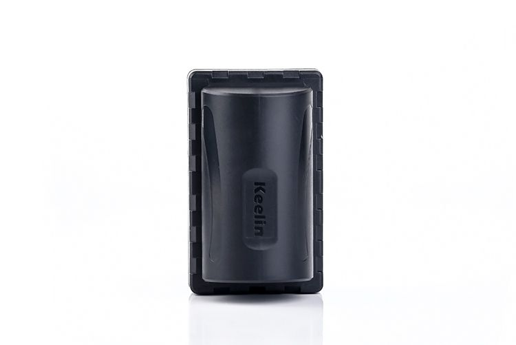

# EElink - GPT09

The EElink GPT09 is a powerful GPS tracker that offers a range of features to ensure accurate and reliable tracking. With support for quad bands \(850/900/1800/1900MHz\), this tracker is universal and can be used anywhere in the world. It is equipped with a built-in 14500mAh super high-capacity zero self-discharge lithium thionyl chloride battery, which allows it to stand up to three years with just 10 minutes of power on and work every 24 hours.

One of the standout features of the GPT09 is its strong magnetic force, which allows it to be easily adsorbed onto iron surfaces. This makes it ideal for covert tracking applications. Additionally, the tracker is designed to withstand tough conditions, with a military-grade three anti-performance that makes it waterproof to IP67 standards.

The GPT09 offers GPS/LBS dual positioning, ensuring accurate and reliable location tracking. It also supports A-GPS for faster and more precise positioning. Users have the flexibility to define working hours by 6, 12, 24, or 48-hour intervals in long standby mode. In emergency situations, the tracker can be switched to real-time tracking mode for immediate monitoring.

The GPT09 is compatible with the Keelin Tracking Service Platform and Keelin APP Client, allowing users to easily track and manage their devices. It also supports EELINK protocol and can be integrated into the platform of customers. Firmware upgrades can be done over-the-air \(OTA\), ensuring that the tracker is always up to date with the latest features and improvements.

#### Key Features:

- Quad band support for global use
- 14500mAh super high-capacity battery for up to three years of standby time
- Strong magnetic force for easy attachment to iron surfaces
- Military-grade three anti-performance for waterproofing \(IP67\)
- GPS/LBS dual positioning with A-GPS support
- Flexible working hour settings
- Emergency mode for real-time tracking
- Compatible with Keelin Tracking Service Platform and Keelin APP Client
- Supports EELINK protocol for integration with customer platforms
- OTA firmware upgrades for easy maintenance

