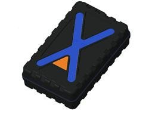

# EElink - GPT48‑X

The GPT48‑X is a long‑standby GPS tracker engineered for durable asset tracking in remote or intermittently connected environments. It combines LTE Cat‑M and NB‑IoT cellular connectivity with multi‑GNSS positioning to provide persistent location awareness. Housed in a rugged IP67 enclosure with strong magnetic mounting and designed for minimal maintenance, the GPT48‑X is suited to fleet assets, containers, and equipment that require reliable tracking and tamper detection over long deployment periods.

As a Plaspy compatible device, the GPT48‑X integrates into fleet and asset management workflows to deliver location, device status, and event alerts into Plaspy dashboards and reporting. The device uses the EELINK protocol and supports remote configuration via platform, mobile app, or SMS, enabling operators to manage reporting behavior, geofence alerts, and emergency reporting modes centrally within Plaspy. This compatibility helps reduce field visits and supports scalable deployments across large asset fleets.

## Key Highlights

- 8000 mAh battery with ultra long standby and up to five year sleep mode for reduced maintenance cycles
- Low power cellular connectivity using LTE Cat‑M and NB‑IoT for wide area coverage and extended battery life
- Multi GNSS support for improved positioning reliability across different regions
- Rugged IP67 enclosure with strong magnetic mounting for quick attachment to metal assets
- Smart wake features, tamper detection, and geofence alerts to notify operators of movement or intrusion
- Emergency reporting mode for high frequency updates when movement is detected and remote management via OTA and platform commands
- Integrates with Plaspy via the EELINK protocol for streamlined onboarding and centralized monitoring

## How It Works with Plaspy

When connected to Plaspy, the GPT48‑X streams location and device event data into Plaspy dashboards where operators can monitor live positions, device health, and historical movements. Plaspy decodes EELINK protocol fields to display battery state, tamper conditions, and reporting mode, and applies rules to balance low power operation with responsiveness when assets move.

- Real time location and telemetry updates feed Plaspy live maps and status panels for operational visibility
- Vibration and tamper alerts trigger Plaspy notifications and automatic geofence checks for rapid response
- Geofence alerts and recovery workflows can be configured to notify teams and log events for audits
- Historical reporting and exportable location trails support incident review and asset lifecycle analysis
- Remote configuration and OTA updates allow Plaspy operators to adjust reporting schedules and device settings without frequent site visits
- Integration of external sensor or control data is supported if a particular installation provides those signals to the tracker

## Typical Use Cases

- Long term asset monitoring for trailers, containers, and seasonal equipment where maintenance access is limited
- Fleet oversight for low usage vehicles that benefit from long battery life and movement alerts
- Anti theft and recovery operations using tamper detection and emergency reporting to speed response
- Equipment yard and depot monitoring to reduce site visits and track asset location and battery health
- Container and cargo tracking where rugged mounting and reliable GNSS positioning are required

## Why Choose This Tracker with Plaspy

The GPT48‑X offers a practical combination of long battery life, rugged construction, and multi GNSS positioning that aligns with the needs of organizations managing dispersed or intermittently used assets. Its design reduces total cost of ownership by minimizing maintenance cycles while preserving the ability to receive timely alerts and high frequency updates when movement occurs.

Integration through the EELINK protocol and support for remote configuration and OTA updates simplify rollout and ongoing management in Plaspy. For fleets and asset managers who prioritize long deployment life, reliable location reporting, and centralized monitoring, the GPT48‑X is a solid candidate. Confirm any specific I O or sensor interface requirements with your supplier to ensure the chosen hardware variant meets your telemetry and control needs.

To learn more about Plaspy and how this tracker can be used in your operations visit https://www.plaspy.com. Product specifications, availability, and manufacturer details can change over time so verify current specifications with the official manufacturer documentation at https://www.eelink.com.cn/ before finalizing procurement.
