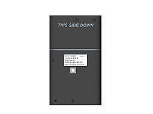

# EElink - GPT49

The GPT49 is a Plaspy compatible 4G LTE GPS tracker that brings ultra‑long standby life and global positioning coverage to equipment and valuables. Designed for enterprise asset management, the GPT49 combines multi‑constellation GNSS \(GPS, GLONASS, BeiDou, Galileo and QZSS\) with wide cellular support \(GSM, WCDMA and LTE FDD/TDD\) so Plaspy can deliver reliable real‑time tracking and location history for assets around the world.

With a large 6500 mAh lithium manganese battery and selectable low‑power daily wake or emergency real‑time tracking modes, the GPT49 is optimized for long unattended deployments where anti‑theft protection, telemetry reporting, and tamper detection matter. Its rugged, waterproof/dust‑proof enclosure and compact dimensions make it a practical addition to Plaspy's fleet management and asset‑monitoring toolset.

## Key Highlights

- Plaspy compatible 4G LTE GPS tracker for consistent real‑time tracking and location reporting.
- Multi‑constellation GNSS \(GPS, GLONASS, BeiDou, Galileo, QZSS\) for faster fixes and improved accuracy worldwide.
- Massive 6500 mAh battery offering an ultra‑long standby life \(estimated 3–5 years in low‑power mode\).
- Dual operation modes: low‑power daily wake for long deployments and emergency real‑time mode when movement is detected.
- Vibration‑wake and light‑sensor tamper alarms plus geofencing for anti‑theft alerts and perimeter monitoring.
- Remote configuration and over‑the‑air firmware updates \(FOTA\) to manage devices at scale without manual retrieval.
- Rugged, compact form factor \(120 × 69 × 19.5 mm, ~150 g\) with IP‑rated protection for outdoor and industrial use.

## How It Works with Plaspy

The GPT49 feeds Plaspy with the GNSS positions, device status, and event flags it generates over cellular networks. Whether assets are stationary in storage or in motion on a jobsite, Plaspy ingests the tracker’s packets to present live location maps, movement history, and actionable alerts—enabling timely responses to theft, unauthorized movement, or operational exceptions.

- Real‑time location and telemetry updates via LTE \(and fallback GSM/WCDMA where supported\) for continuous visibility.
- Movement and tamper event notifications \(vibration‑wake and light‑sensor alarms\) that trigger Plaspy alerts and escalation workflows.
- Geofence events sent to Plaspy to monitor perimeter breaches and arrival/departure reporting for assets.
- Selectable low‑power daily wake and emergency real‑time tracking modes to balance battery life with instant tracking during incidents.
- Remote configuration and FOTA allow Plaspy administrators to update reporting intervals, thresholds, and firmware without physical access.

## Technical Overview

| Connectivity | GSM, WCDMA and LTE FDD/TDD \(4G LTE asset tracker\) |
| --- | --- |
| Bands | Global network compatibility; specific frequency bands not specified |
| Power & Battery | 6500 mAh lithium manganese battery; standby up to 3–5 years \(low‑power mode\); selectable emergency real‑time tracking mode |
| Interfaces | Vibration‑wake, light‑sensor tamper alarm, geofencing support, remote configuration |
| GNSS | Multi‑constellation: GPS, GLONASS, BeiDou, Galileo and QZSS |
| Bluetooth | Not specified |
| Remote Management | Over‑the‑air firmware updates \(FOTA\) and remote device configuration |
| Form Factor | 120 × 69 × 19.5 mm; ~150 g; waterproof and dust‑proof enclosure, designed for outdoor/industrial asset management |

## Use Cases

- Heavy equipment and construction tool tracking — keep long‑term visibility on high‑value, infrequently moved assets with minimal maintenance.
- Seasonal or stored asset protection — long standby battery life makes the GPT49 ideal for assets in storage that require occasional checks and theft protection.
- Container and pallet monitoring — geofencing and tamper alarms enable early detection of unauthorized movement or access.
- Remote site asset cataloging — rugged, waterproof packaging suits outdoor depots, substations, and temporary sites where power is unavailable.
- Small fleet and equipment management — integrate asset locations and status into Plaspy dashboards for centralized tracking and reporting.

## Why Choose This Tracker with Plaspy

The GPT49 is built for durability, autonomy, and global coverage—attributes that align directly with Plaspy’s goals for dependable telemetry and fleet management. Its 4G LTE connectivity and multi‑constellation GNSS provide the core GPS tracker functionality Plaspy relies on for accurate maps and alerts, while the 6500 mAh battery minimizes field maintenance cycles. Remote configuration and FOTA reduce operational overhead for large deployments, and tamper detection features support Plaspy’s anti‑theft workflows.

For organizations that require integrated telemetry—such as fuel monitoring, ignition or immobilizer status, or Bluetooth sensors—Plaspy can correlate additional inputs from your sensor ecosystem alongside GPT49 location and event data. This makes a combined Plaspy + GPT49 solution a strong choice when you need real‑time tracking, long battery life, and scalable remote management without frequent device retrieval.

