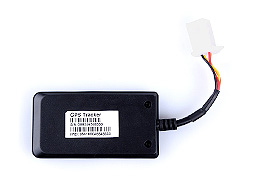

# EElink - TK115

## TK115 GPS Tracker — Plaspy compatible

The TK115 is a compact GPS tracker engineered for electric motorcycles and scooters and is fully Plaspy compatible for straightforward integration into your fleet management and anti-theft workflows. With wide input voltage support, AGPS-enabled GPS/LBS positioning, and real-time tracking, the TK115 delivers the core capabilities fleets and mobility operators need to monitor vehicles, respond to incidents, and automate security actions through Plaspy.

The unit supports ACC \(ignition\) detection and offers an optional relay for remote immobilizer or power/fuel cut-off, making it a practical choice for anti-theft, displacement \(towing\) detection, geofencing and speed controls. Designed to withstand vehicle environments, the TK115 combines small form factor and backup power to maintain connectivity and send low-battery or power-loss alerts into Plaspy for continuous telemetry and operational visibility.

## Key Highlights

- Plaspy compatible GPS tracker built for electric motorcycles and scooters — easy integration into real-time tracking dashboards.
- Wide DC input \(9–60 V\) supports 12/24/36/48 V systems common in electric two-wheelers and light commercial vehicles.
- Real-time GPS/LBS positioning with AGPS for faster fix times and reliable location data \(5–15 m accuracy\).
- ACC/ignition detection plus an optional relay for remote immobilizer or power cut to support anti-theft workflows.
- Multiple security alarms — displacement \(towed\), vibration, speed, and geofence violations — with immediate alerts into Plaspy.
- Compact, lightweight design with backup battery for continuity during power loss and low-battery notifications.
- Rugged operating range \(−20 °C to 70 °C\) suitable for outdoor and vehicle-mounted installations.

## How It Works with Plaspy

When paired with Plaspy, the TK115 feeds continuous telemetry and event data into a central platform where real-time tracking, alerting, and reporting are available to fleet operators and security teams. Plaspy ingests GPS/LBS coordinates, status signals \(such as ACC/ignition\), and alarm events, allowing you to trigger workflows like immobilization, geofence escalation, driver alerts, or maintenance scheduling.

- Real-time location and telemetry updates \(GPS/LBS with AGPS assistance\) for live vehicle visibility.
- ACC \(ignition\) status reporting for accurate trip starts/stops and ignition-based alerts.
- Optional relay control to remotely immobilize a vehicle or cut power/fuel through Plaspy commands.
- Displacement, vibration, speed and geofence alarms sent as instant events to Plaspy for automated notifications and incident handling.
- Power-loss and low-battery alerts from the onboard backup battery to ensure uninterrupted monitoring and fast response.
- Integrates into fleet telemetry workflows — including fuel monitoring and additional sensor data — when combined with Plaspy’s sensor and reporting capabilities.

## Technical Overview

| Connectivity | GSM 2G \(850 / 900 / 1800 / 1900 MHz\) |
| --- | --- |
| Bands | 850 / 900 / 1800 / 1900 MHz \(quad-band GSM\) |
| Power & Battery | Wide DC input 9–60 V \(suitable for 12/24/36/48 V systems\); onboard backup battery for power-loss and low-battery alerts |
| Interfaces | ACC \(ignition\) detection; optional relay for remote immobilizer / power or fuel cut |
| GNSS | GPS with AGPS support; positioning accuracy approx. 5–15 m |
| Bluetooth | Not specified |
| Remote Management | Remote parameter setting supported \(configuration changes managed remotely\) |
| Form Factor & Environment | Dimensions: 71.8 × 38.5 × 10.5 mm; Weight: 42 g \(tracker\) + 42 g backup battery; Operating temperature: −20 °C to 70 °C; designed for motorcycle/scooter installation |

## Use Cases

- Fleet anti-theft and immobilization — remotely cut power or fuel via the optional relay when suspicious activity is detected.
- Scooter and electric motorcycle sharing fleets — real-time tracking, geofencing and speed limits to enforce safe use and operational zones.
- Last-mile delivery and couriers on two-wheel vehicles — ACC detection and trip reporting for accurate routing and time-on-task measurement.
- Towed/displacement detection and vibration alerts — immediate notification when a vehicle is moved or tampered with for quick incident response.
- Fleet telemetry and maintenance workflows — combine TK115 data with Plaspy analytics for proactive maintenance and fuel monitoring routines via external sensors.

## Why Choose This Tracker with Plaspy

The TK115 pairs practical vehicle-focused features with Plaspy’s platform to deliver a reliable, secure solution for managing electric two-wheel fleets and individual scooter/motorcycle assets. Its wide voltage acceptance and compact form factor make installation simple across diverse vehicle types, while ACC detection and an optional immobilizer relay provide tangible anti-theft controls. By feeding GPS/LBS data, alarms and power-status events into Plaspy, operators gain real-time tracking, actionable telemetry, and automated incident response—improving security, reducing downtime, and supporting operational goals like fuel monitoring, route compliance and asset recovery.

