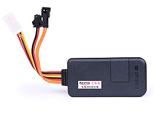

# EElink - TK116

The TK116 is a compact GPS tracker from EElink designed for dependable fleet management and motorcycle tracking. It combines GPS and base station positioning with AGPS assistance to provide continuous location updates and supports event reporting such as ACC detection, crash and vibration alarms, geofencing, and optional SOS and relay features to support anti theft workflows.

As a Plaspy compatible device out of the box, the TK116 can feed its location and event telemetry into Plaspy to enable centralized visibility, alerting, and reporting. Plaspy can use the TK116 data to help operators monitor vehicles, respond to incidents, and integrate the tracker into routine fleet operations without additional middleware.

## Key Highlights

- Native compatibility with Plaspy for straightforward integration into a real time tracking dashboard
- Combined GPS and base station positioning with AGPS assistance for faster fixes in varied conditions
- Event reporting including ACC detection plus crash, vibration and speed alarms to improve safety oversight
- Optional relay support for remote fuel or power cut off to enable immobilizer style anti theft actions
- SOS button and optional microphone for emergency alerts and remote listening where configured
- Compact and lightweight form factor suitable for vehicles and motorcycles with a built in backup battery

## How It Works with Plaspy

When a TK116 is registered with Plaspy it streams position and event messages to the platform so fleet managers and dispatchers can visualize current locations, review historical traces, and receive configurable alerts. Plaspy reads the tracker’s telemetry and maps events into notifications, reports, and operational rules.

- Real time location updates and telemetry appear in Plaspy for continuous monitoring of assets
- Ignition and ACC status are reported to support run stop analytics and ignition based rules
- Crash, vibration and speed alarms trigger instant alerts in Plaspy to speed incident response
- Remote immobilizer actions via the optional relay can be coordinated through Plaspy workflows
- SOS and optional microphone events are captured and routed to Plaspy for emergency handling

## Typical Use Cases

- Fleet management for cars, vans and light trucks requiring route visibility and event monitoring
- Motorcycle tracking and recovery where a compact low weight tracker is preferred
- Anti theft workflows that use event alarms and remote relay actions to limit unauthorized movement
- Safety and emergency response using crash detection and SOS alerts to notify dispatchers
- Operational telemetry and reporting to reduce idle time and improve asset utilization

## Why Choose This Tracker with Plaspy

The TK116 delivers a focused set of tracking and event features that align with common fleet and motorcycle use cases. Its compact size, event reporting capabilities, and optional relay and emergency functions mean it provides the core inputs Plaspy needs to present meaningful location views, alerts, and historical reports without unnecessary complexity.

For organizations seeking a practical, cost conscious tracker that integrates into a full fleet management platform, the TK116 and Plaspy form a straightforward combination. Plaspy uses the device data to improve visibility, automate notifications, and support anti theft and safety procedures while keeping configuration and daily operations centralized.

Learn more about Plaspy on the main website https://www.plaspy.com. Product specifications, availability, and manufacturer details can change over time so please verify current specifications with the manufacturer at https://www.eelink.com.cn/.
