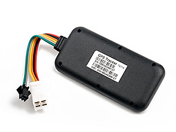

# EElink - TK119

# TK119 GPS Tracker

The TK119 is a compact, rugged vehicle GPS tracker designed for reliable, Plaspy compatible real-time tracking and fleet management. Built for vehicles that need continuous telemetry and anti-theft protection, the TK119 combines multi-constellation GNSS positioning \(GPS/BDS/GLONASS\) with GSM communications and a suite of safety alarms to keep assets visible and secure on Plaspy dashboards.

Measuring 87 × 41.6 × 12 mm and IP65-rated, the TK119 is suitable for daily fleet use and demanding environments where dust and water resistance matter. With ACC detection, an optional relay for remote fuel/power cut-off, GPIO expansion, and position assistance via AGPS and LBS, it integrates with Plaspy using MoveLink/EELINK protocol for fast alerts, location history, and operational reporting.

## Key Highlights

- Plaspy compatible: Integrates via MoveLink/EELINK for straightforward connection to Plaspy platforms and dashboards.
- Accurate multi-constellation GNSS: GPS/BDS/GLONASS positioning with AGPS and LBS assistance for reliable real-time tracking.
- Robust safety alarms: Crash/fall, vibration, speed, geofence, and low-battery/power-off alerts to support anti-theft and driver safety workflows.
- Vehicle control options: ACC detection plus an optional relay for remote fuel/power cut-off that can serve as a remote immobilizer when required.
- Wide voltage support: Accepts 9–72 V \(listed 12/24/36/48/60 V DC nominal ranges\) to suit cars, trucks, and heavy equipment.
- Compact, weather resistant form factor: IP65-rated enclosure and a 70 mAh backup battery for continuity during power interruptions.

## How It Works with Plaspy

The TK119 transmits location and telemetry over GSM to Plaspy-compatible backends using the MoveLink/EELINK protocol. Once connected to Plaspy, position updates, event alarms, and digital input states appear on real-time maps and in configurable reports. Plaspy can receive and act on the TK119’s alerts \(for example, immobilize via relay command or notify on geofence violations\), enabling integrated fleet management and anti-theft workflows.

- Real-time location and telemetry updates pushed to Plaspy for live tracking and historical routes.
- ACC/ignition detection to report engine on/off status and support ignition-based rules and reports.
- Crash/fall, vibration, speed and geofence alarms forwarded to Plaspy for instant notifications and incident logging.
- Optional relay control for remote fuel/power cut-off, enabling immobilizer-style functions through Plaspy commands when deployed.
- Low-battery and power-off alerts ensure continued situational awareness and reduce downtime in fleet operations.

## Technical Overview

| Connectivity | GSM \(2G\) — 850 / 900 / 1800 / 1900 MHz |
| --- | --- |
| GNSS | GPS / BDS / GLONASS with AGPS and LBS assistance |
| Positioning Accuracy | 5–15 m \(typical\) |
| Power & Battery | Wide input 9–72 V \(12/24/36/48/60 V listed\); 70 mAh backup battery |
| Interfaces | ACC detection \(ignition\), optional relay for remote fuel/power cut-off, GPIO expansion for external sensors |
| Safety & Alerts | Crash/fall alarm, vibration alarm, speed alarm, geofencing, low-battery/power-off alerts |
| Remote Integration | MoveLink / EELINK protocol for platform integration \(Plaspy compatible\) |
| Form Factor | 87 × 41.6 × 12 mm; 50 g; IP65 water & dust protection |

## Use Cases

- Fleet management: Live vehicle tracking, route history, and ACC-based reporting for cars, vans, and trucks.
- Anti-theft and immobilization: Immediate alerts plus an optional relay to remotely cut fuel/power when theft is detected.
- Driver safety and incident response: Crash/fall and vibration alarms feed Plaspy incident workflows for faster response.
- Asset monitoring in harsh environments: IP65 protection and wide voltage input make the TK119 suitable for commercial and industrial vehicles.

## Why Choose This Tracker with Plaspy

When you need a dependable, compact GPS tracker that plugs into Plaspy ecosystems, the TK119 delivers a balance of accuracy, vehicle control, and ruggedness. Its multi-constellation GNSS and AGPS/LBS assistance provide consistent real-time tracking, while the GSM bands ensure broad cellular coverage. For fleet operators, TK119’s ACC detection and optional relay enable ignition-aware reporting and remote immobilization via Plaspy, improving anti-theft protection and operational control. The GPIO expansion lets integrators add door, alarm, or custom sensors, feeding telemetry and events into Plaspy reports and alerts.

Overall, the TK119 is a practical choice for organizations focused on telemetry-driven fleet management, anti-theft measures, and reliable location services. Its Plaspy compatibility—via MoveLink/EELINK—means quick integration into dashboards, rule engines, and mobile alerts so teams can act on real-time insights without lengthy custom development.

