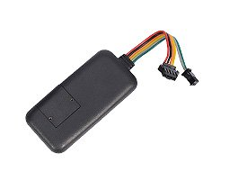

# EElink - TK119‑3G

The TK119‑3G is a compact vehicle GPS tracker from EElink designed for reliable deployment across fleets and individual vehicles. It provides GPS and base station positioning with AGPS assistance and uses WCDMA and GSM cellular connectivity to deliver real‑time location and event data. The unit includes vehicle inputs and optional outputs such as ACC ignition detection and a relay for remote immobilization, plus safety alarms for crash, vibration and overspeed events.

As a Plaspy compatible device, the TK119‑3G is suitable for operators who need continuous location visibility, event alerts and historical reporting within a fleet management platform. Plaspy can consume the device’s position fixes, ignition status and alarm events to provide monitoring, notifications and operational reporting that support anti‑theft workflows, driver safety programs and routine fleet oversight.

## Key Highlights

- Plaspy compatible GPS tracker for real time tracking and fleet visibility
- Dual cellular support with GPS and LBS positioning plus AGPS assistance for faster fixes
- ACC ignition detection for engine on and engine off event reporting
- Optional relay for remote immobilizer or fuel and power cut interventions
- Crash, fall, vibration and overspeed alarms with automatic power cut functionality
- RS232 expansion port to integrate external telemetry or fuel monitoring devices
- Small and lightweight form factor for discreet vehicle or asset installation

## How It Works with Plaspy

When connected to Plaspy, the TK119‑3G forwards position updates and telemetry over cellular networks where Plaspy processes and presents the information for real time monitoring and historical analysis. Plaspy uses the device’s positioning modes and event signals to maintain continuity of tracking, trigger alerts, and produce reports that support dispatch, compliance and theft response.

- Real time location updates and fall back base station positioning to maintain continuity
- Ignition and engine state events captured for accurate engine on and engine off logs
- Safety alarms such as crash, vibration and overspeed forwarded to Plaspy for immediate notification and logging
- Remote immobilizer or relay control actions available in Plaspy for anti theft intervention workflows
- RS232 peripheral data relayed into Plaspy to extend telemetry such as fuel or third party sensor readings

## Typical Use Cases

- Fleet anti theft and remote immobilization using the optional relay and overspeed power cut features
- Driver safety and incident response with crash/fall and vibration alerts feeding into monitoring workflows
- Fuel monitoring and extended telemetry via RS232 integration with external sensors or devices
- Real time dispatch and route management using continuous GPS/LBS position updates
- Tamper and power loss detection to maintain asset visibility during attempted removal or shutdown

## Why Choose This Tracker with Plaspy

The TK119‑3G offers a balance of compact hardware and practical inputs and outputs that make it a good fit for many fleet and vehicle tracking deployments. Its event signals and optional relay give operators tools to implement anti‑theft and safety policies, while RS232 expansion enables broader telemetry integration for fleets that need additional data points such as fuel monitoring.

Pairing the TK119‑3G with Plaspy brings those device signals into a single monitoring and reporting environment so teams can act on location, alarm and status information quickly. For organizations looking for straightforward integration of ignition events, alarms and peripheral telemetry into a commercial fleet management platform, the TK119‑3G is a capable option to consider.

To learn more about Plaspy and platform capabilities visit https://www.plaspy.com. Product specifications, availability and manufacturer details can change over time, so please verify current technical information on the manufacturer site https://www.eelink.com.cn/.
