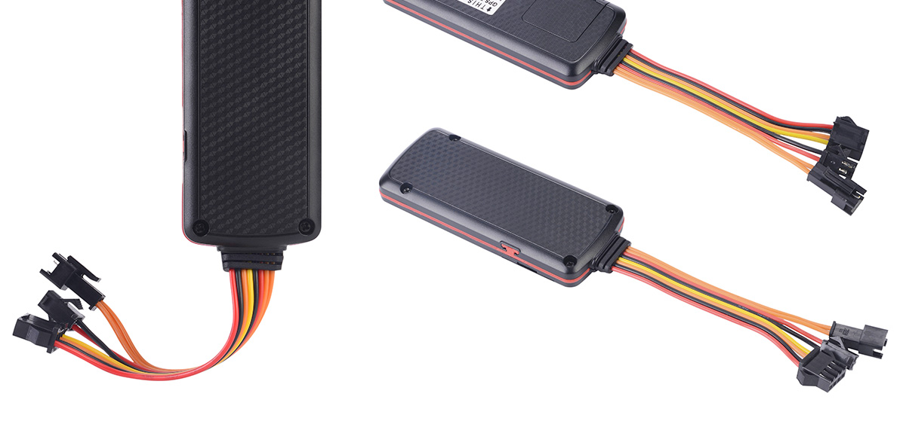

# EElink - TK319

The EElink TK319 series, marketed as the TK319-H in some materials, is a compact 3G network GPS tracker designed for a broad range of tracking tasks. It combines GPS and LBS locating methods with AGPS assistance to deliver timely location updates over GSM/WCDMA networks. The device targets use cases such as vehicle rental, logistics, bus and fleet management, risk management, and general IoT asset tracking where continuous position visibility and basic telematics are required.

As a Plaspy compatible device, the TK319 can feed location and event data into Plaspy for centralized monitoring and reporting. Its features like ACC status detection, remote relay control, geofence alerts, and optional temperature sensing align with common fleet and asset management workflows in Plaspy. This compatibility makes the TK319 a practical option for organizations that want to integrate device-level tracking with a full fleet management platform.

## Key Highlights

- Compact 3G GPS tracker suitable for vehicle and asset tracking applications
- GPS and LBS dual locating with AGPS assistance for faster fixes
- Real time data upload using GSM WCDMA networks for continuous visibility
- ACC detection for monitoring ignition or usage state
- Relay option enabling remote engine cut off for asset control
- Optional temperature sensor for monitoring temperature sensitive loads
- GEO fence, speed, collision and low battery alarms for operational alerts

## How It Works with Plaspy

When used with Plaspy, the TK319 supplies position and event data to the platform so teams can monitor assets in one place. Plaspy records incoming updates and presents them through maps, timelines, and alert feeds to support operational oversight.

- Live vehicle and asset location displayed on Plaspy maps for dispatch and monitoring
- Historical route playback and data logs for trip review and reporting
- Alert forwarding and notifications for events such as geofence breaches, speed incidents, and low battery
- Status indicators for ACC and relay actions to help track usage and immobilization events
- Temperature readings (when the optional sensor is fitted) visible in Plaspy for cold chain or sensitive cargo monitoring

## Typical Use Cases

- Vehicle rental operations requiring location tracking and ignition status monitoring
- Logistics and delivery fleets needing route visibility and historical playback
- Bus and passenger fleet oversight with centralized monitoring and alerts
- Risk management and theft response workflows using remote relay control and geofence alarms
- IoT deployments that benefit from compact tracking hardware and optional temperature sensing

## Why Choose This Tracker with Plaspy

The TK319 offers a balanced set of features that map well to Plaspy workflows: dual locating methods for resilient positioning, real time network uploads for current visibility, and a set of safety and control functions that support fleet operations. Its compact form factor and remote configuration options make it practical to deploy across mixed fleets and asset types where straightforward tracking and alerting are needed.

While the TK319 provides many useful capabilities, organizations should match device options such as the temperature sensor or relay functionality to their operational requirements. In combination with Plaspy, the TK319 can deliver a focused solution for teams that need consistent location reporting, standard alarms, and centralized fleet oversight.

To learn more about how Plaspy works with compatible trackers like the EElink TK319, visit https://www.plaspy.com. Product specifications, availability, and manufacturer details can change over time, so please verify current specifications and certifications on the EElink official website https://www.eelink.com.cn/.
