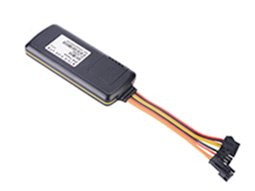

# EElink - TK419

The TK419 is a compact 4G GPS tracker designed for vehicle fleets and asset security. Built for reliable real‑time tracking, the unit supports multi‑constellation positioning \(GPS, GLONASS, BeiDou and QZSS\) and transmits telemetry over GPRS and LTE Cat 1 networks. With a small footprint \(89 × 37 × 12 mm\) and IP65 water‑resistant housing, TK419 fits discreetly in cars, trucks and mobile assets while delivering continuous location and alarm data to Plaspy‑compatible platforms.

Plaspy compatible out of the box, TK419 integrates with Plaspy for live location, alerts and fleet management workflows. It offers ignition \(ACC\) detection, optional relay‑based engine disable \(immobilizer\), crash and vibration alarms, geofencing and remote configuration via platform, app or SMS. TK419 is aimed at businesses that need dependable anti‑theft protection, real‑time telemetry and straightforward integration via the EELINK protocol.

## Key Highlights

- Plaspy compatible 4G GPS tracker for reliable real‑time tracking and fleet management.
- Multi‑GNSS support \(GPS/GLONASS/BeiDou/QZSS\) for improved position accuracy and faster fixes.
- ACC detection plus optional relay for remote immobilizer functionality and anti‑theft control.
- Crash/acceleration and vibration alarms, speed alarm with overspeed cut‑off and geofencing for safety and compliance.
- Customizable GPIO ports to connect telemetry sensors, enabling fuel monitoring and other vehicle data when required.
- 140 mAh backup battery for power‑loss alerts and continued reporting during brief interruptions.
- Compact, rugged design \(IP65\) and wide 9–72 V DC input range for versatile vehicle installations.

## How It Works with Plaspy

TK419 sends GNSS positions and status telemetry to Plaspy over cellular data \(GPRS/LTE Cat 1\). Plaspy ingests location, alarm and IO data, turning raw messages into live maps, alerts and reports for fleet managers. Integration uses the device’s supported EELINK protocol and standard Plaspy ingestion mechanisms so you can deploy at scale without custom gateway work.

- Real‑time location and telemetry updates via LTE Cat 1 or fallback GPRS.
- Ignition \(ACC\) status for trip detection and fuel/consumption event correlation.
- Optional relay control for remote immobilizer actions triggered from Plaspy dashboards or rules.
- Crash/acceleration and vibration alarms forwarded immediately to Plaspy for rapid incident response.
- Geofence events, speed alarms and overspeed cut‑off are reported to Plaspy for alerts and compliance logs.
- Backup battery notifications on power loss to protect against tampering and theft attempts.
- Custom GPIO inputs allow telemetry such as fuel monitoring to be transmitted to Plaspy where sensors are present.

## Technical Overview

| Connectivity | GPRS and LTE Cat 1 |
| --- | --- |
| GNSS | GPS, GLONASS, BeiDou, QZSS |
| Inputs / Outputs | ACC detection; customizable GPIO ports; optional relay \(engine disable\); optional SOS button |
| Alarms & Alerts | Crash/acceleration alarm, vibration alarm, speed alarm with overspeed cut‑off, geofencing |
| Backup Battery | 140 mAh \(power‑loss alerts\) |
| Power | 9–72 V DC input |
| Protection Rating | IP65 water‑resistant |
| Protocol & Integration | EELINK protocol; remote configuration via platform/app/SMS |
| Dimensions & Weight | 89 × 37 × 12 mm, 46 g |
| Form Factor | Compact vehicle tracker for concealed mounting |

## Use Cases

- Fleet anti‑theft and immobilization — use ACC detection and remote relay to secure vehicles remotely.
- Driver behavior and safety management — monitor speed, trigger overspeed cut‑off and log crash/vibration events for follow‑up.
- Geofence‑based site control — generate entry/exit alerts for yards, timed routes or restricted zones.
- Telemetry and asset monitoring — attach telemetry sensors via GPIO for fuel monitoring, temperature or custom inputs and report to Plaspy.
- Emergency response and driver assistance — optional SOS button and immediate crash alerts provide faster incident notification.

## Why Choose This Tracker with Plaspy

TK419 delivers a practical balance of compact design, broad vehicle compatibility and Plaspy‑ready integration for businesses that require dependable real‑time tracking and anti‑theft controls. Its multi‑GNSS receiver and cellular fallback ensure continuous position reporting, while ACC detection and optional immobilizer relay support common fleet management and security workflows. The device’s GPIO flexibility lets you extend telemetry capability — for example, fuel monitoring — and feed those metrics into Plaspy for centralized reporting and alerts.

For systems integrators and fleet operators, EELINK compatibility and remote configuration via platform/app/SMS reduce deployment friction and ongoing management overhead. When combined with Plaspy’s dashboards and rules engine — and in deployments that also use Bluetooth sensors for specific telemetry needs — TK419 becomes a robust node in a scalable fleet management and anti‑theft solution. Choose TK419 with Plaspy for reliable tracking, fast incident awareness and straightforward integration into existing telematics ecosystems.

