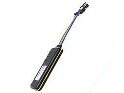

# EElink - TK419‑3

The TK419‑3 is a compact, Plaspy compatible GPS tracker designed for vehicle-focused real-time tracking and telemetry. With LTE Cat 1 and legacy GSM connectivity and multi-constellation GNSS \(GPS/GLONASS/BeiDou/QZSS\) plus AGPS assistance, the TK419‑3 delivers continuous position updates and event-driven alerts that integrate directly into Plaspy for fleet management, anti-theft protection, and remote diagnostics.

The device combines a rugged IP65 enclosure, wide 9–72 V DC input range, and a built-in 160 mAh emergency battery in a lightweight 89 × 37 × 12 mm form factor. Plaspy-compatible configuration and remote command support let operators use the TK419‑3 for ignition detection, immobilizer-style relay control, telemetry reporting, and customizable alarms—making it a versatile option for commercial fleets, rental vehicles, and high-value assets.

## Key Highlights

- Plaspy compatible for seamless integration into real-time tracking dashboards and fleet management workflows.
- 4G connectivity \(LTE Cat 1\) with GSM fallback for wide-area coverage and consistent telemetry delivery.
- Multi-constellation GNSS: GPS/GLONASS/BeiDou/QZSS with AGPS for faster fixes and reliable positioning.
- Vehicle I/O: ACC ignition detection plus optional relay for remote fuel/power cut‑off or immobilizer functions.
- Expandable interfaces: GPIO expansion pins and RS232 for connecting temperature sensors, iButton, and other accessories.
- Comprehensive alarms: collision/fall, vibration, speed alarm with optional overspeed cut‑off, SOS button option, and geofencing.
- Rugged, compact form factor \(IP65, 89 × 37 × 12 mm, 46 g\) and wide voltage range \(9–72 V DC\) for vehicle and asset use.
- Built-in 160 mAh emergency battery to maintain reporting during primary power loss.

## How It Works with Plaspy

When paired with Plaspy, the TK419‑3 streams location and telemetry data to the platform for live tracking, alerts, and historical reporting. Plaspy ingests the device’s GNSS fixes, I/O states, and alarm events, then normalizes them into map updates, driver and vehicle telemetry, and configurable notifications. Remote configuration and commands issued from Plaspy can adjust reporting intervals, enable/disable features, or trigger relay-based actions such as immobilization.

- Real-time location and telemetry updates \(GNSS fixes delivered to Plaspy for map visualization\).
- Ignition detection \(ACC\) and status reporting to support start/stop analytics and duty logging.
- Fuel monitoring and control workflows using external sensors and the optional relay for fuel/power cut‑off.
- Remote immobilizer-style control via the optional relay \(relay activation can be issued from Plaspy where supported\).
- Accessory telemetry from GPIO/RS232 \(temperature sensors, iButton access logs\) exposed in Plaspy reports.
- Event-driven alerts in Plaspy for collision/fall, vibration, geofence entry/exit, speed alarms, and SOS triggers.

## Technical Overview

| Connectivity | LTE Cat 1 \(4G\) with GSM fallback \(2G\) |
| --- | --- |
| Bands | Not specified in device description |
| Power & Battery | Operating voltage 9 V–72 V DC; built-in 160 mAh emergency battery for power-loss reporting |
| Interfaces | ACC ignition input; optional relay for remote fuel/power cut‑off; optional SOS button; expansion GPIO pins; RS232 for sensors/accessories |
| GNSS | GPS, GLONASS, BeiDou, QZSS with AGPS assistance |
| Bluetooth | Not specified / no Bluetooth indicated |
| Remote Management | Remote configuration supported \(over-the-air parameter updates via platform\) |
| Form Factor & Durability | IP65-rated enclosure; dimensions 89 × 37 × 12 mm; weight 46 g |

## Use Cases

- Fleet management and route monitoring — real-time tracking and ignition telemetry for efficient dispatch and utilization reporting.
- Anti-theft and immobilization — relay-controlled fuel/power cut‑off and geofence alerts to secure vehicles remotely.
- Driver safety and incident response — collision/fall and SOS alerts routed through Plaspy for rapid notification.
- Temperature-sensitive cargo monitoring — connect external temperature sensors via RS232 or GPIO to log and report conditions.
- Rental and service vehicle tracking — small footprint and wide voltage range make the TK419‑3 suitable for mixed-vehicle fleets and short-term installs.

## Why Choose This Tracker with Plaspy

Pairing the TK419‑3 with Plaspy gives operators a compact, reliable GPS tracker that balances robust vehicle I/O and sensor expandability with modern cellular connectivity. The device’s multi-constellation GNSS and AGPS support improve fix times and accuracy for real-time tracking, while ACC detection, optional relay immobilization, and a 160 mAh emergency battery provide the core anti-theft and telemetry controls fleet managers expect. Plaspy’s platform exposes the TK419‑3’s alarms, speed and ignition events, and accessory data in configurable dashboards and reports—enabling scalable fleet management, precise telemetry analysis, and quick remote intervention when incidents occur.

