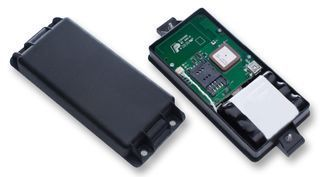

# Enfora - GSM 5108

The Enfora GSM 5108 is part of the innovative Enfora Spider MT family of certified dual and quad-band integrated platforms. These platforms provide complete GSM/GPRS functionality for mobile tracking applications. With the Enfora GSM 5108, you can transmit GPS data to centralized operations centers, web pages, localized computers, or mobile data terminals worldwide via GSM cellular radio.

Enfora's Services Gateway 2.0 software platform allows for quick deployment by building links from your asset-tracking devices to your existing enterprise applications and services. This platform provides a development and deployment environment for complex tracking, monitoring, and reporting applications. It supports popular enterprise database architectures such as MS SQL Server, MySQL, and Oracle, reducing your time to market and helping you generate revenues faster.

The Enfora GSM 5108 offers a range of key features to meet your tracking needs. It supports Garmin's Fleet Management Interface \(FMI\) for enhanced functionality. The included software suite enables virtually any telematics application. The built-in programmable rules engine, network router, and control automation capabilities allow for flexible customization. The MT-Gµ model even has a wireless data and voice port for user email and voice communication. Other features include geo-fencing, GPIOs, internal antennas for economical installation and serviceability, auto-registration on power up, internal battery back-up for continued operation during power outages, and integrated SMS for commands and messages.

Whether you have demanding fleet operations or simple place-n-trace applications, the Enfora GSM 5108 is designed to exceed your expectations. With its advanced features and reliable performance, it is a versatile GPS tracker that can be tailored to your specific tracking requirements.

