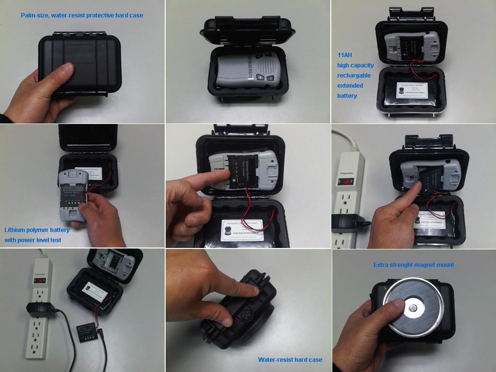

# Enfora - Mini MT

The Enfora Mini MT is a compact, voice enabled quad band GPS tracker designed for demanding mobile workforces and private users who prioritize location based safety and connectivity. Built to provide complete GSM GPRS communications, the Mini MT offers reliable GPS performance, motion sensing, vibrating alerts, two way voice and messaging, and a programmable panic or emergency response button in a small rugged package.

As a Plaspy compatible device, the Mini MT can be integrated into fleet and safety workflows to give operators real time visibility and event awareness. Plaspy can surface location updates, emergency signals, and motion related events from the Mini MT, helping organizations monitor small fleets, remote workers, and vulnerable individuals with a unified tracking and reporting view.

## Key Highlights

- Certified quad band GPS tracker offering broad cellular coverage for mobile deployments
- Compact and rugged voice enabled design suited for workforce and personal applications
- Built in panic or emergency response button for immediate event signaling
- Motion sensor and vibrating alerts to report activity and disturbances
- Programmable device behavior with remote upgrade capability using FOTA
- Suitable for rapid deployment in remote worker and personal safety programs

## How It Works with Plaspy

Plaspy receives and processes the positional and event information that the Mini MT transmits, presenting that data in dashboards, maps, and operational workflows to support monitoring, alerting, and reporting.

- Live location visibility and map playback for individual Mini MT units
- Event and alert handling for panic button activations and motion detected events
- Fleet level monitoring to group units, view status, and spot exceptions
- Configurable notifications and workflows based on device events and movement
- Historical reports and exportable logs for audits and operational analysis

## Typical Use Cases

- Remote worker safety programs where rapid incident response is required
- Small fleet tracking and operational oversight for service vehicles
- Personal safety and monitoring for elderly care and medical check ins
- Child and teen tracking for location based family safety
- Mobile or home healthcare coordination and patient location awareness

## Why Choose This Tracker with Plaspy

The Mini MT combines a compact, rugged hardware footprint with voice and messaging capabilities and explicit emergency signaling, making it a practical choice for organizations that need straightforward location and safety monitoring. Its programmability and FOTA capability reduce the overhead of device maintenance while providing the features commonly required for workforce and personal protection programs.

Using the Mini MT with Plaspy brings those device capabilities into a broader operational context. Plaspy adds map based visibility, alert routing, group management, and reporting so teams can turn device events into operational actions without managing multiple point solutions. For organizations evaluating devices for safety oriented tracking, the Mini MT presents a balance of portability, event signaling, and suitability for remote deployments.

To learn more about how Plaspy can work with compatible devices like the Enfora Mini MT, visit https://www.plaspy.com. Product specifications, availability, and manufacturer details can change over time, so please verify current technical information on the official manufacturer site http://www.enfora.com/.
