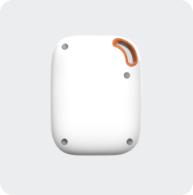

# EV - EV-04

# EV-04 Personal 4G GPS Tracker Pendant

The EV-04 is a compact, Plaspy compatible GPS tracker pendant engineered for dependable personal protection and remote patient monitoring. Built on an MTK platform and supporting multi-band 4G with fallback to 3G/2G, this lightweight wearable combines one-button SOS, highly sensitive fall detection, two-way calling, and multiple positioning technologies so caregivers and monitoring services receive timely, accurate alerts and location data.

The EV-04 integrates seamlessly with the Plaspy platform for real-time tracking, audible alerts, and centralized telemetry. Its IP67 water resistance, soft-touch housing \(≈53 g\), and optional Bluetooth beacons for improved indoor accuracy make it a practical solution for seniors, patients, and lone workers who need an always-on SOS device paired with Plaspy monitoring and reporting tools.

## Key Highlights

- Plaspy compatible GPS tracker pendant for instant SOS reporting and centralized monitoring.
- One-button SOS with two-way calling \(integrated speaker & microphone\) for direct voice communication during emergencies.
- Highly sensitive fall detection \(reported >70% accuracy\) plus automatic SOS triggering and voice prompts/TTS to guide users.
- Multi-tech location: GPS, Wi‑Fi, BLE Beacon and LBS with automatic updates as frequently as every 10 seconds during SOS.
- Compact, lightweight IP67 design with LED indicators, dedicated charging base \(Bluetooth 5.0\) and drop-in charging convenience.
- Supports Bluetooth pairing with medical devices for remote patient monitoring \(RPM\) without requiring a separate app on the user’s phone.
- FOTA \(remote firmware upgrades\), medication reminders, Web + iOS/Android platform and rebranding support for commercial deployments.

## How It Works with Plaspy

When integrated with Plaspy, the EV-04 becomes a purpose-built personal GPS tracker that feeds location and event telemetry into Plaspy’s real-time dashboard and alerting engine. Whether used in a monitored service or self-monitoring mode, Plaspy displays live position, event history, and device health while forwarding SOS calls and notifications to predefined contacts or monitoring centers.

- Real-time location and telemetry updates delivered to Plaspy, including live tracking during SOS events \(updates as often as every 10 seconds\).
- Automatic fall detection and one-button SOS events forwarded to Plaspy for immediate action by caregivers or monitoring centers.
- Two-way voice calls initiated from the device, with Plaspy logging call events and status changes for audit and follow-up.
- Bluetooth sensors and BLE beacons for enhanced indoor positioning and optional pairing with medical devices to stream RPM data into Plaspy without extra user apps.
- Device management and firmware updates \(FOTA\) coordinated through Plaspy-compatible workflows for remote maintenance.

## Technical Overview

| Connectivity | Multi-band 4G \(primary\) with fallback to 3G/2G; MTK platform |
| --- | --- |
| Bands | Multiple 4G bands supported \(models vary\); automatic fallback to 3G/2G where available |
| Power & Battery | Rechargeable internal battery; dedicated drop-in charging base included; battery optimization features for extended standby and SOS modes |
| Interfaces | One-button SOS, two-way calling with integrated speaker & microphone, LED status indicators, TTS/voice prompts, pairing for Bluetooth medical devices |
| GNSS & Positioning | GPS plus Wi‑Fi, BLE Beacon and LBS \(cell tower\) hybrid positioning; automatic high-frequency updates during alarm events |
| Bluetooth | BLE support for beacons and medical-device pairing; charging base uses Bluetooth 5.0 |
| Remote Management | FOTA \(remote firmware upgrade\); Web + iOS/Android platform for tracking, alerts and battery monitoring; rebranding supported |
| Form Factor & Durability | Pendant-style wearable, soft-touch square design, approx. 53 g, IP67 water resistance for daily use |

## Use Cases

- Personal protection for seniors and elderly family members — SOS button, fall detection and live GPS tracking for rapid response.
- Remote patient monitoring \(RPM\) — BLE pairing with medical devices and medication reminders, with telemetric data accessible via Plaspy.
- Lone worker safety — lightweight SOS pendant that provides voice communication and location to Plaspy for rapid incident handling.
- Home care and assisted living — optional BLE beacons improve indoor accuracy and charging base with extra SOS support simplifies daily use.

## Why Choose This Tracker with Plaspy

The EV-04 delivers a clear value proposition when paired with Plaspy: rapid, reliable real-time tracking and event telemetry in a compact, user-friendly pendant. Integration with Plaspy enables centralized incident handling, auditing of SOS and call logs, and remote device management via FOTA. Its Bluetooth sensor support and BLE beacon options extend capabilities for indoor accuracy and RPM without forcing caregivers or users to manage separate apps.

While the EV-04 is optimized for personal safety, healthcare and lone-worker protection rather than fleet management or vehicle telemetry, its Plaspy compatibility means organizations can incorporate the EV-04 into broader monitoring portfolios. Note that vehicle-specific features like fuel monitoring, ignition sensing or immobilizer control are not part of this device’s feature set—choose EV-04 with Plaspy when the priority is personal GPS tracking, two-way emergency voice, fall detection and medical telemetry.

