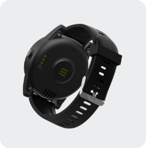

# EV - EV-05

The EV-05 Mobile Safety Watch is a wearable GPS tracker designed for continuous personal protection. Packaged as a wristwatch for seniors, patients, and lone workers, it combines position tracking with safety and health monitoring features such as SOS, fall detection, heart rate alerts, and two-way voice so caregivers and monitoring teams can maintain situational awareness of the wearer.

As a Plaspy compatible device out of the box, the EV-05 forwards location points, safety events, and health telemetry into Plaspy’s platform. That compatibility lets monitoring centers and caregivers see SOS events, fall alerts, and vital signs alongside other GPS devices on Plaspy, making the watch a practical choice for organizations that need wearable personal safety integrated into a single tracking platform.

## Key Highlights

- Wearable form factor purpose built for continuous personal safety and everyday wear.
- Multi modal location methods including 4G with fallback plus Wi‑Fi and beacon assistance for wider coverage.
- Dedicated SOS and emergency features with fast live updates during incidents to speed response times.
- Health and activity monitoring including heart rate alerts and activity counts for caregiver notifications.
- Fall detection and no motion alerts to highlight unattended events and potential incidents.
- IP67 waterproof rating and a lockable strap to support reliable 24/7 use in varied conditions.
- Flexible deployment options: can be used for self monitoring or integrated with managed monitoring services.

## How It Works with Plaspy

When the EV-05 is used with Plaspy it transmits location, safety events, and monitored health data so those signals appear on Plaspy dashboards, alerts, and reports. Plaspy users can track live movement, receive high priority notifications for SOS or fall events, and include wearable telemetry in fleet or personal safety workflows.

- Live location and telemetry are visible on Plaspy maps and history views so operators can follow movements in near real time.
- SOS and fall events are delivered as high priority alerts into Plaspy for immediate notification and workflow triggers.
- Health telemetry such as heart rate readings are forwarded to Plaspy for monitoring and caregiver notifications.
- Bluetooth sensor readings and presence events can be relayed through the watch into Plaspy for consolidated patient monitoring.
- Geofence entry and exit events plus presence based triggers can feed automated rules and notifications in Plaspy.
- Two way voice and emergency call events can be logged so operators have context about communication during an incident.

## Typical Use Cases

- Elderly care and independent living monitoring to provide quick intervention on SOS or fall alerts.
- Remote patient monitoring and caregiver oversight where heart rate and presence information matters.
- Lone worker protection for personnel who need wearable safety with voice communication and no motion alerts.
- Managed monitoring services and alarm centers that consolidate wearable alerts with other monitored devices.
- Home care agencies and community support programs that track wellbeing and location for higher risk clients.

## Why Choose This Tracker with Plaspy

The EV-05 pairs wearable personal safety features with platform level visibility, making it a sensible option for organizations that want to include people tracking and health alerts alongside traditional GPS devices. Its design emphasizes continuous wearability and dependable incident reporting, which helps ensure telemetry quality for monitoring teams using Plaspy.

Because the EV-05 sends location points, SOS signals, fall detections, and health telemetry into Plaspy, teams can manage mixed deployments from a single platform and apply consistent alerting, reporting, and response procedures. For groups that need scalable, real time wearable monitoring integrated into their operational workflows, the EV-05 with Plaspy offers a practical, easy to incorporate solution.

To learn more about Plaspy and how compatible devices are managed on the platform visit https://www.plaspy.com. Product specifications, availability, and manufacturer details can change over time, so verify current technical details and regional model variations on the manufacturer site http://www.eviewltd.com/.
