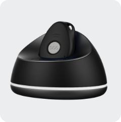

# EV - EV-07B

The EV-07B from Eview is a compact, wearable GPS tracker and one-button mPERS pendant designed for straightforward personal safety. As a mini SOS device it combines continuous location reporting with basic telemetry and two-way voice alerting to give wearers a simple way to call for help. The form factor and feature set make it suitable for everyday carry by seniors, lone workers, patients and mobile users who need a discreet emergency button and location visibility.

This model is Plaspy compatible out of the box, so SOS events, location updates and telemetry from the EV-07B can flow into Plaspy for mapping, notification and reporting. When integrated with Plaspy, the EV-07B extends the platform’s situational awareness for caregivers, security teams and monitoring services, allowing responders to see near real time position and event history when an alarm occurs.

## Key Highlights

- Designed as a compact wearable SOS pendant with a single emergency button for rapid alarm activation.
- Continuous location reporting and high frequency updates during active SOS events for improved situational awareness.
- Two-way voice calling and voice prompts to enable direct communication between the wearer and a responder.
- Built in alerting features including fall detection, no motion alerts and low battery notifications to support monitoring workflows.
- BLE 5.0 support for pairing with external sensors and beacon devices to enhance indoor location and telemetry options.
- Available in 2G and 4G LTE variants, with an AT&T certified 4G model for broad U.S. coverage where LTE is available.
- Small, lightweight form factor with multiple wearing options and an IP67 waterproof rating for daily use.

## How It Works with Plaspy

When connected to Plaspy, the EV-07B forwards location, SOS alarms and basic telemetry so monitoring teams can act quickly. Plaspy ingests events from the device and surfaces them in maps, event logs and notification channels to reduce response time and improve oversight.

- Real time location updates and combined location sources forwarded into Plaspy mapping for live tracking.
- SOS alarm activation appears as a high priority event and can trigger configurable notifications and escalation rules.
- Device alerts such as fall detection, no motion and low battery are recorded in Plaspy as event types for review and reporting.
- Bluetooth sensor telemetry and beacon information can be presented in Plaspy to support remote patient monitoring or expanded context.
- Battery and charging base status are visible in Plaspy to help with proactive device maintenance and uptime.

## Typical Use Cases

- Assisted living and elderly care where one-button SOS and fall alerts are routed to caregivers and monitoring centers.
- Lone worker safety for staff who need a wearable emergency alarm and near real time location visibility.
- Remote patient monitoring scenarios that pair BLE medical peripherals and forward events to caregivers or clinical teams.
- Everyday protection for travelers, children and outdoor users needing a lightweight emergency contact device.
- Home companion setups using a charging base for at-home convenience and rapid escalation through monitoring workflows.

## Why Choose This Tracker with Plaspy

The EV-07B is a focused personal safety tracker that fits into Plaspy’s monitoring and reporting ecosystem without unnecessary complexity. Its wearable design, combined with multi source location support and BLE sensor compatibility, makes it practical for organizations that need to provide rapid alarm handling and location awareness for people rather than vehicles or equipment.

Paired with Plaspy, the EV-07B supports both self monitoring and professional monitoring center deployments by delivering relevant events, location updates and device status into a unified platform. This makes it easier to include SOS workflows, caregiver notifications and basic telemetry reporting in existing operational processes.

To learn more about Plaspy and how compatible devices like the EV-07B can be used in your monitoring setup visit https://www.plaspy.com. Product specifications and availability can change over time, so please verify current technical details and certification information on the manufacturer website http://www.eviewltd.com/.
